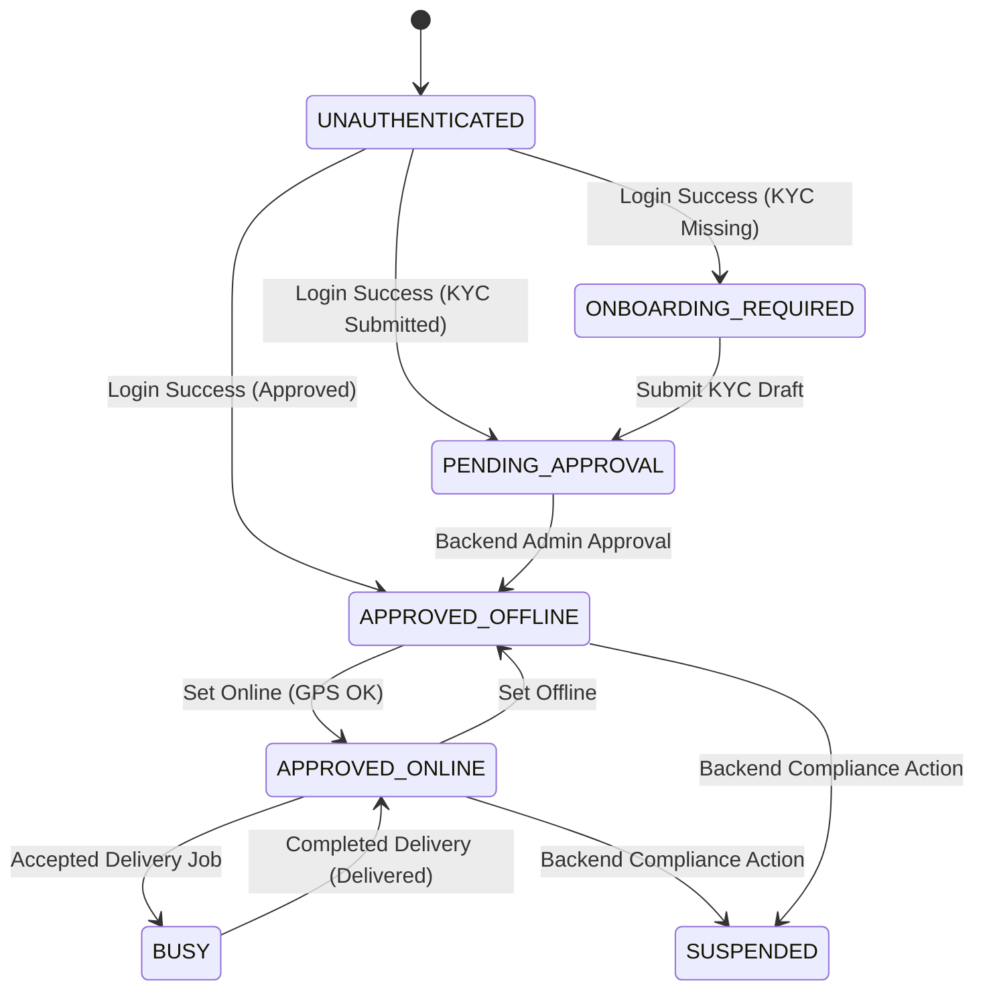
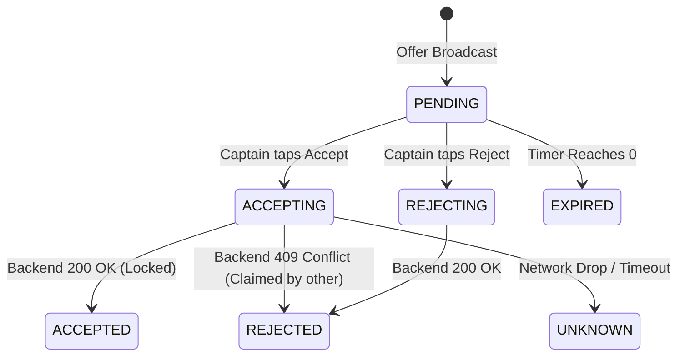
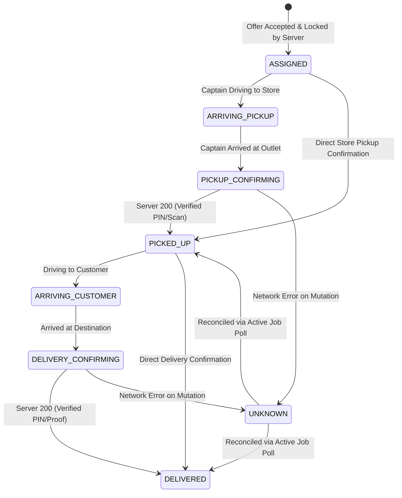

# MyPet Captain Mobile Application — Architecture & Server-Authority Contract

## 1. Core Server-Authoritative Principle

The MyPet Captain mobile application operates under a strict **Server-Authoritative Distributed Architecture**:

> **THE BACKEND IS THE SOLE AUTHORITY FOR BUSINESS STATE.**
>
> The Captain mobile application MUST NEVER synthesize, infer, or fabricate successful business state transitions.

```
+-------------------------------------------------------------------------+
|                       CORE DISTRIBUTED SYSTEM RULE                      |
|                                                                         |
|  Network Failure != Business Success                                    |
|  Timeout         != Delivery State Advancement                          |
|  Uncertainty     -> State: UNKNOWN / Reconciliation Pending             |
+-------------------------------------------------------------------------+
```

### Prohibited Client Syntheses
The client is strictly prohibited from:
- Assuming `accepted = true` or creating local delivery assignments upon network timeout or drop.
- Transitioning to `PICKED_UP` when the backend `/api/v1/captain/dispatch/{jobId}/picked-up` endpoint is unreachable.
- Transitioning to `DELIVERED` when the backend `/api/v1/captain/dispatch/{jobId}/delivered` endpoint is unreachable.
- Generating synthetic order IDs, delivery IDs, customer names, addresses, or fake earnings in production or error fallback flows.
- Overriding onboarding or KYC approval states client-side.

---

## 2. Layered Architecture & Boundary Separation

The Captain codebase in `apps/captain-app/src` is organized into explicit domain and architectural layers:

```
src/
├── api/             # Pure transport & HTTP client layer (No synthetic business state)
│   ├── client.ts         # Generic fetch client with timeout & typed AppError mapping
│   ├── auth.ts           # /api/v1/auth endpoints
│   ├── availability.ts   # PUT /api/v1/captain/availability
│   ├── captain.ts        # GET /api/v1/captain/me
│   ├── dispatch.ts       # Offers, offer responses, pickup/delivered mutations
│   ├── deliveries.ts     # Active delivery & delivery history projections
│   ├── earnings.ts       # Payout summaries & earnings ledger
│   ├── onboarding.ts     # Drafts & submission
│   ├── notifications.ts  # Captain notification feed
│   └── support.ts        # Support ticket submission
│
├── auth/            # Authentication & session token management
│   ├── session.ts        # SecureStore / localStorage token envelope storage
│   ├── context.tsx       # AuthProvider exposing session lifecycle
│   └── types.ts          # Session tokens and account profiles
│
├── domain/          # Pure models, state machines & error taxonomies (Zero React deps)
│   ├── result.ts         # Result<T, E>, AppError, AppErrorKind
│   ├── command.ts        # MutationCommand<T>, CommandState, CommandOutcome<T>
│   ├── captain.ts        # CaptainState, CaptainProfile, computeCaptainState()
│   ├── dispatch.ts       # DispatchOffer, DispatchAssignment, DeliveryAddress
│   ├── delivery.ts       # DeliveryJob, DeliveryState, canTransitionDelivery()
│   ├── onboarding.ts     # OnboardingDraft, identity, vehicle & bank models
│   └── earnings.ts       # CaptainEarningsSummary, settlement items
│
├── repositories/    # Data access orchestrators & mutation runners
│   ├── dispatch-repository.ts     # Offers query & offer acceptance with idempotency
│   ├── delivery-repository.ts     # Active job query & pickup/delivered mutations
│   ├── availability-repository.ts # Presence and coordinates updates
│   ├── onboarding-repository.ts   # Draft retrieval and submission
│   └── earnings-repository.ts     # Financial data aggregation
│
├── sync/            # Offline resilience, durable command queue & reconciliation
│   ├── connectivity.ts   # Network connectivity listener
│   ├── command-store.ts  # Persistent command queue (SecureStore / local storage)
│   ├── command-runner.ts # Executes mutations, generates idempotency keys, classifies outcomes
│   └── reconciliation.ts # Recovers UNKNOWN states when network connectivity returns
│
├── location/        # Geolocation services & periodic uploaders
│   ├── permissions.ts         # Foreground & background permission checkers
│   ├── foreground-location.ts # High-accuracy GPS position getter & coordinate validation
│   ├── background-location.ts # Background location task definitions
│   └── location-uploader.ts   # Throttled (15s minimum) availability uploader
│
├── state/           # React Context state stores & reactive pipelines
│   ├── captain-store.tsx  # Captain domain state, presence, and profile management
│   └── delivery-store.tsx # Active job lifecycle, incoming offers & action dispatchers
│
├── components/      # Design system & reusable UI components
├── app/             # Expo Router screens and tab navigation
└── utils/           # Currency, date, and validation utilities
```

---

## 3. Explicit State Machines

### 3.1 Captain Lifecycle State (`CaptainState`)



| State | Description |
|---|---|
| `UNAUTHENTICATED` | No valid session tokens exist. |
| `ONBOARDING_REQUIRED` | Authenticated, but KYC, vehicle, or bank verification details are incomplete. |
| `PENDING_APPROVAL` | Onboarding documents submitted; awaiting operations verification. |
| `APPROVED_OFFLINE` | Approved Captain in good standing, currently offline. |
| `APPROVED_ONLINE` | Approved Captain online, publishing GPS updates, eligible for dispatch offers. |
| `BUSY` | Online Captain currently assigned to an active delivery order. |
| `SUSPENDED` | Account suspended due to policy, documentation expiry, or compliance flags. |

---

### 3.2 Dispatch Offer State (`DispatchOfferState`)



---

### 3.3 Delivery Job Lifecycle State (`DeliveryState`)



---

### 3.4 Mutation Command Outcomes (`CommandOutcome<T>`)

Every business state mutation (offer acceptance, pickup confirmation, delivery completion) yields one of three mutually exclusive outcomes:

```typescript
export type CommandOutcome<T> =
  | { outcome: 'ACKNOWLEDGED'; data: T; idempotencyKey: string }
  | { outcome: 'REJECTED'; error: AppError; idempotencyKey: string }
  | { outcome: 'UNKNOWN'; commandId: string; idempotencyKey: string; error: AppError };
```

1. **`ACKNOWLEDGED`**: The backend processed the command and returned HTTP 2xx. The client updates local domain state to match the authoritative server payload.
2. **`REJECTED`**: The backend rejected the mutation with HTTP 4xx (e.g., 409 Conflict - offer claimed elsewhere, 400 Validation - invalid OTP). The client displays the error and marks the command as completed without retry.
3. **`UNKNOWN`**: Network failed, timed out, or connection was dropped. **The client does NOT advance business state.** The command is saved to `CommandStore` with its `Idempotency-Key` and scheduled for reconciliation.

---

## 4. Error Taxonomy (`AppError`)

Errors across the application are normalized into structured `AppError` instances:

| Kind | Description | Retryable |
|---|---|---|
| `NetworkUnavailable` | No internet connection, socket failed, DNS resolution failure. | Yes |
| `Timeout` | Request timed out after configured threshold (e.g., 8000ms). | Yes |
| `AuthenticationExpired` | HTTP 401 Unauthorized; token expired or invalid. | No (Triggers refresh) |
| `AuthorizationDenied` | HTTP 403 Forbidden; insufficient role or account suspended. | No |
| `ResourceNotFound` | HTTP 404 Not Found; delivery or offer deleted. | No |
| `Conflict` | HTTP 409 Conflict; offer claimed by another captain or state conflict. | No |
| `ValidationRejected` | HTTP 400 / 422; invalid PIN, incorrect document format, bad payload. | No |
| `ServerFailure` | HTTP 500, 502, 503, 504; backend internal exception. | Yes |
| `UnknownOutcome` | Mutating request status uncertain due to connection drop. | Yes (Reconcile) |

---

## 5. Verification & Automated Tests

Server-authoritative behavior is continuously validated via automated tests in `apps/captain-app/src/__tests__/`:

```bash
# Run all unit and contract tests in captain-app
npm test

# Run TypeScript typechecks
npm run typecheck

# Run ESLint validation
npm run lint
```

Key test suites:
- `src/__tests__/domain/server-authority.test.ts`: Proves offer accept, pickup confirm, and delivery confirm never synthesize success on network error, timeout, or server 500.
- `src/__tests__/domain/state-machines.test.ts`: Validates delivery and captain state machine rules and transitions.
- `src/__tests__/sync/command-runner.test.ts`: Validates idempotency key generation, command persistence, and error categorization.
- `src/__tests__/features/delivery-e2e.test.ts`: Validates complete 5-stage delivery lifecycle with mocked HTTP responses.
