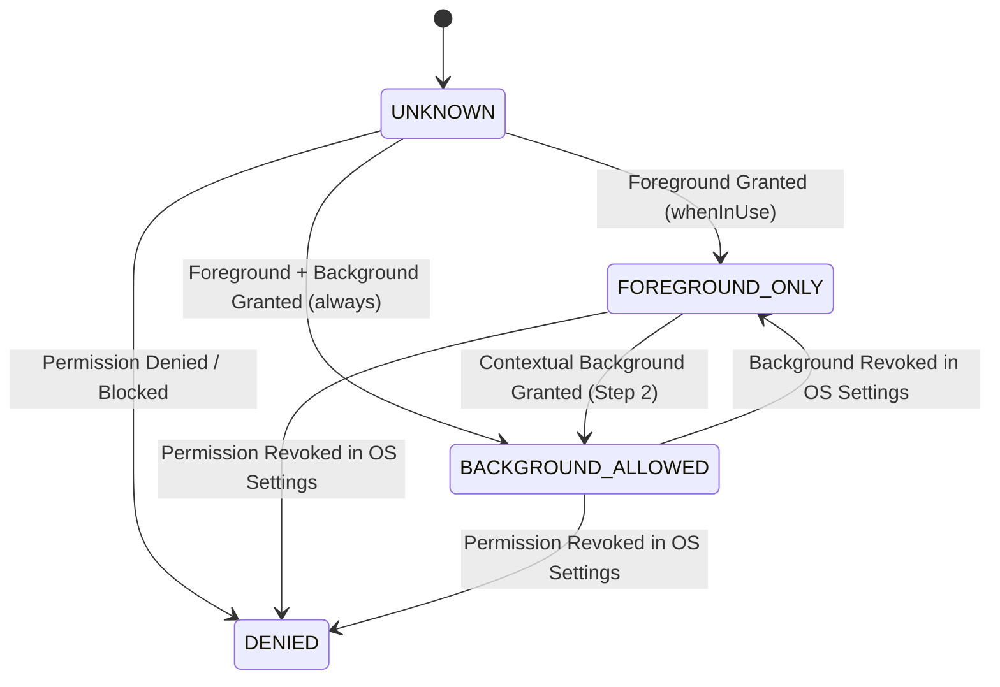
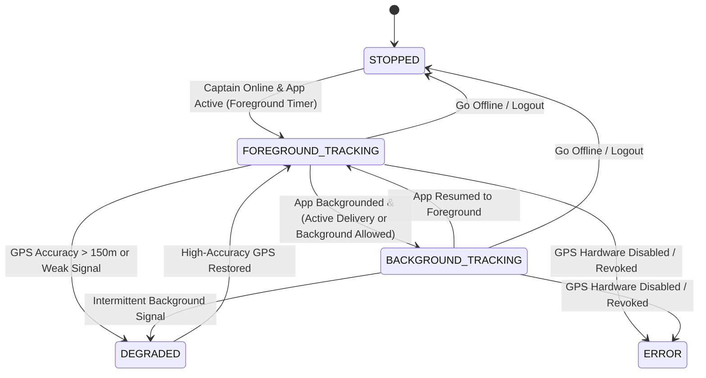
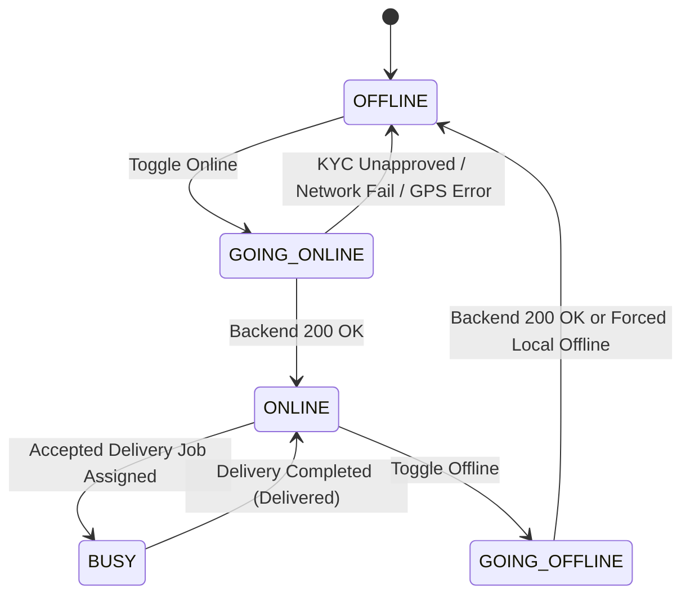
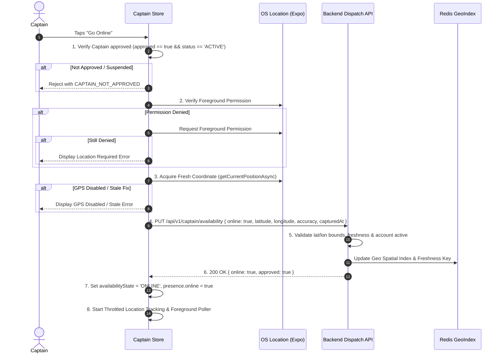
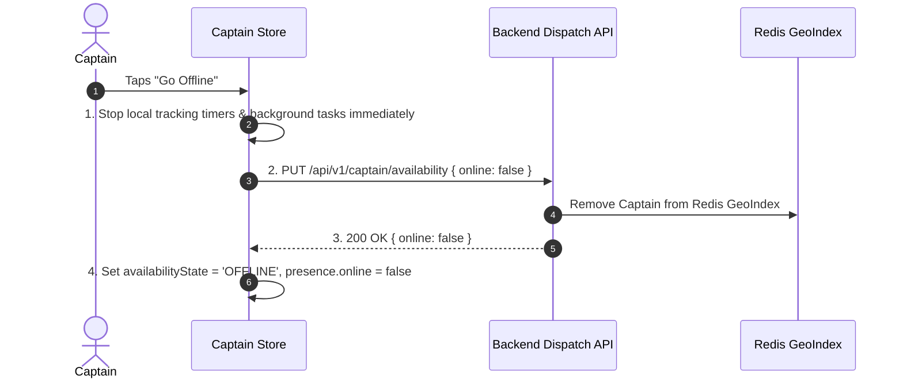

# MyPet Captain Location Lifecycle, Availability, Privacy & Background Architecture

## 1. Executive Summary & Architectural Principles

The MyPet Captain mobile application and backend delivery dispatch platform operate under a strict **Server-Authoritative, Privacy-Preserving Geo Architecture**.

Location data is collected **only when legitimately required** for dispatch allocation and active delivery fulfillment, strictly respecting Captain availability state, operating system permissions, and user privacy.

```
+-----------------------------------------------------------------------------------+
|                           CORE GEO ARCHITECTURAL RULES                            |
|                                                                                   |
| 1. Server Authority    : Captain online status is determined solely by backend    |
|                          acknowledgment (HTTP 200). Local GPS availability !=      |
|                          Online state.                                            |
| 2. Staged Permissions  : ACCESS_BACKGROUND_LOCATION is never requested at launch. |
|                          Foreground first, background contextually when needed.   |
| 3. Adaptive Throttling : Uploads are filtered by time interval and displacement   |
|                          (Haversine distance), varying by active delivery status. |
| 4. Privacy & Minimization: Raw GPS coordinates and customer addresses are never   |
|                          logged in plaintext. Cache is cleared on logout.         |
| 5. Native Background   : Active deliveries maintain background GPS tracking via   |
|                          expo-task-manager and expo-location foreground services. |
+-----------------------------------------------------------------------------------+
```

---

## 2. Explicit State Machines

The location and availability architecture is governed by three decoupled, orthogonal state machines:

### 2.1 Location Permission State (`LocationPermissionState`)

Represents the device operating system's permission grants for the Captain app:



| State | Description | Capabilities |
|---|---|---|
| `UNKNOWN` | Permissions have not yet been queried from the OS. | Initial cold-start state. |
| `DENIED` | Foreground location access was denied or permanently blocked. | Cannot go online or receive offers. |
| `FOREGROUND_ONLY` | High-accuracy foreground GPS granted (`ACCESS_FINE_LOCATION`). | Can go online and track while app is open. |
| `BACKGROUND_ALLOWED` | Foreground + background GPS granted (`ACCESS_BACKGROUND_LOCATION`). | Full background tracking during active deliveries. |

---

### 2.2 Captain Location Activity State (`CaptainLocationActivityState`)

Represents active hardware GPS polling and background tracking lifecycle:



| State | Description |
|---|---|
| `STOPPED` | Location tracking is completely idle (offline or logged out). Zero battery/network consumption. |
| `FOREGROUND_TRACKING` | Actively polling high-accuracy GPS while the application is in foreground. |
| `BACKGROUND_TRACKING` | Registered native background task (`MYPET_CAPTAIN_BACKGROUND_LOCATION`) executing via `expo-task-manager`. |
| `DEGRADED` | GPS fix is available but accuracy exceeds 150m or updates are intermittent. |
| `ERROR` | GPS hardware is toggled off (`GPS_DISABLED`) or permissions revoked mid-session. |

---

### 2.3 Captain Availability State (`AvailabilityState`)

Represents server-authoritative Captain online availability:



| State | Description |
|---|---|
| `OFFLINE` | Captain is offline on backend dispatch engine. Ineligible for offers. |
| `GOING_ONLINE` | Intermediate transitional state validating approval, permissions, GPS fix, and awaiting server 200 OK. |
| `ONLINE` | Authoritatively online; publishing periodic location updates; eligible for dispatch offers. |
| `GOING_OFFLINE` | Intermediate transitional state submitting offline presence mutation to server. |
| `BUSY` | Currently executing an active delivery order. |

---

## 3. Server Authority & Presence Lifecycle

### 3.1 Going Online Sequence

The application enforces a rigorous multi-step gate before transitioning to `ONLINE`:



> [!IMPORTANT]
> If the network drops or times out at Step 4, the outcome is `UNKNOWN`. **The client MUST NOT transition to `ONLINE`.** It sets `presenceError` and remains `OFFLINE`.

---

### 3.2 Going Offline Sequence



---

## 4. Background Location & Staged Permission UX

### 4.1 Android & iOS Compliance Requirements

- **No Premature Background Requests**: In compliance with Android 10+ (API 29) and Android 11+ (API 30+) requirements, `ACCESS_BACKGROUND_LOCATION` is **never requested simultaneously** with foreground location or at first app launch.
- **Staged 2-Step User Flow**:
  1. **Step 1 (Foreground)**: Requested when onboarding or tapping "Go Online". User allows "While using the app".
  2. **Step 2 (Background)**: Contextual screen explaining *why* background access is needed ("To navigate orders and provide accurate customer tracking when your phone is locked during active deliveries"). User initiates "Allow all the time".

### 4.2 Native Task Definition (`expo-task-manager`)

Background location is registered via `TaskManager.defineTask`:

```typescript
export const CAPTAIN_BACKGROUND_LOCATION_TASK = 'MYPET_CAPTAIN_BACKGROUND_LOCATION';

TaskManager.defineTask(
  CAPTAIN_BACKGROUND_LOCATION_TASK,
  async ({ data, error }) => {
    if (error) {
      logger.error('BackgroundLocation', 'Background error', error);
      return;
    }
    if (data?.locations?.length) {
      const fix = data.locations[data.locations.length - 1];
      // Feed to LocationUploader with displacement & time filters
      await locationUploader.uploadCoordinates(fix.coords, isOnline);
    }
  }
);
```

---

## 5. Location Upload Model & Adaptive Throttling

### 5.1 Upload Payload Schema

```json
{
  "online": true,
  "latitude": 13.628841,
  "longitude": 79.419284,
  "accuracy": 8.5,
  "capturedAt": "2026-08-23T12:00:00.000Z",
  "heading": 85.0,
  "speed": 12.4
}
```

### 5.2 Backend Rejection Rules

| Scenario | Rejection Code | Description |
|---|---|---|
| `latitude !in -90.0..90.0` or `longitude !in -180.0..180.0` | `LOCATION_INVALID` (400) | Latitude/longitude out of range or NaN/Infinite. |
| `accuracy < 0.0` or NaN | `LOCATION_INVALID` (400) | Negative or invalid accuracy value. |
| `capturedAt` $> 5\text{ minutes}$ in past or $> 60\text{s}$ in future | `LOCATION_STALE` (400) | Stale or skewed timestamp. |
| Captain account suspended (`status != 'ACTIVE'`) | `RESOURCE_NOT_FOUND` / `403` | Suspended identity fails closed. |
| Unapproved captain calling `dispatch.start(...)` | `CAPTAIN_NOT_ELIGIBLE` | Excluded from dispatch candidate index. |

---

### 5.3 Adaptive Throttling Filter

To prevent battery drain and API spam, `LocationUploader` applies an adaptive displacement and time filter:

| Operating Mode | Max Time Interval | Min Displacement | Min Burst Limit |
|---|---|---|---|
| **Idle Online** (Waiting for orders) | 25 seconds | 25 meters | 4 seconds |
| **Active Delivery** (En route to store/customer) | 10 seconds | 15 meters | 3 seconds |

Distance is computed locally using the **Haversine formula**:
$$d = 2 R \arcsin\left(\sqrt{\sin^2\left(\frac{\Delta \text{lat}}{2}\right) + \cos(\text{lat}_1)\cos(\text{lat}_2)\sin^2\left(\frac{\Delta \text{lon}}{2}\right)}\right)$$

---

## 6. Privacy & Data Minimization

1. **No Raw Coordinate Plaintext Logging**: Application loggers sanitize coordinates to 2 decimal places with masking (`13.62***, 79.41***`).
2. **Customer Address & Phone Sanitization**: Customer addresses are masked (`***, Bangalore`) and phone numbers masked (`+919******10`) in logs.
3. **No Unbounded Local Breadcrumbs**: Coordinates are ephemeral; only `lastKnownCoordinates` and `lastUploadedCoordinates` are held in memory.
4. **Logout Teardown**:
   - `stopBackgroundLocation()` terminates the native background task.
   - `locationUploader.clearCache()` resets internal memory and cancels intervals.
   - Best-effort offline presence notification sent to backend.
   - Secure store credentials purged.

---

## 7. Automated Test Suite Matrix

| Test Suite | File | Tests Covered |
|---|---|---|
| **Permission State Machine** | `location-lifecycle.test.ts` | UNKNOWN, DENIED, FOREGROUND_ONLY, BACKGROUND_ALLOWED transitions. |
| **Permission Denials** | `location-lifecycle.test.ts` | Foreground denial blocks online; background denial allows foreground only. |
| **GPS Fix & Validation** | `location-lifecycle.test.ts` | GPS disabled error, boundary validation, stale coordinate rejection. |
| **Throttling & Displacement** | `location-lifecycle.test.ts` | Haversine distance, idle throttling, active delivery high-frequency adaptation. |
| **Background & Logout** | `location-lifecycle.test.ts` | Background task start/stop, logout cache cleanup. |
| **Privacy Redaction** | `location-lifecycle.test.ts` | Coordinate masking, address masking, phone masking. |
| **Server Authority** | `server-authority-location.test.ts` | Rejected mutation remains offline; UNKNOWN outcome remains offline; ACKNOWLEDGED transitions to online. |
| **Backend Validation** | `DispatchServiceTest.kt` | Out of bounds lat/lon, negative accuracy, NaN coordinates, stale timestamps. |

---

## 8. Verification Commands

```bash
# Run Mobile Unit Tests
cd apps/captain-app
npm test

# Run TypeScript Typecheck
npm run typecheck

# Run ESLint Validation
npm run lint

# Run Backend Delivery Unit Tests
./gradlew :backend:test --tests "in.mypetnew.delivery.*"
```
