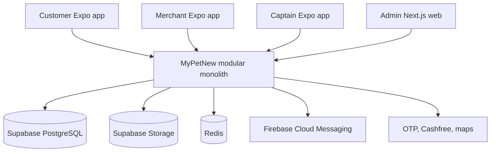
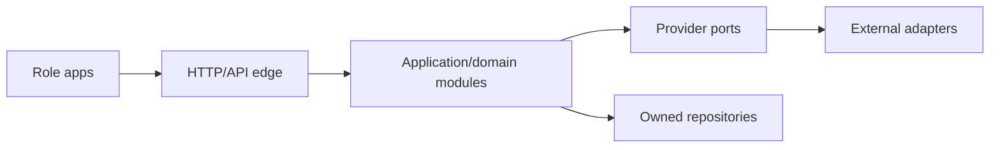
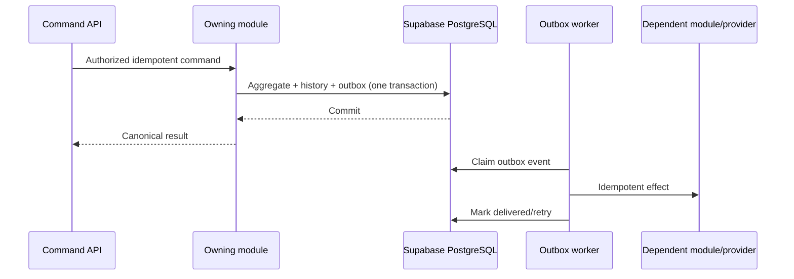
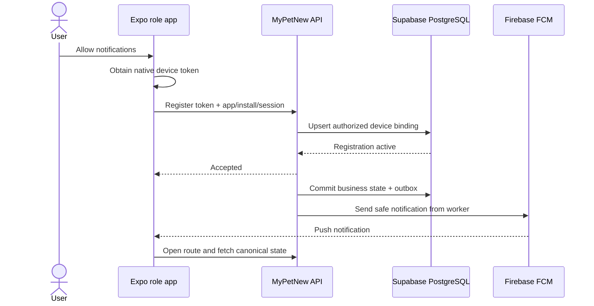

# System Context and Selective-Reuse Boundaries

Status: **Authoritative architecture baseline**  
Version: **1.1**  
Date: **2026-08-11**

## 1. Target system



### Deployment rule

The backend is one production process and one Flyway-managed application schema in a Supabase PostgreSQL project per environment. Domain modules preserve ownership boundaries in code and database naming. Customer, Merchant, Captain, and Admin clients call only the MyPetNew API; they never query application tables through the Supabase Data API. Redis supports cache, rate limit, locks, and later GEO; it is not a business source of truth.

## 2. Repository target layout

```text
Mypetnew/
├── apps/
│   ├── customer-app/
│   ├── merchant-app/
│   ├── captain-app/
│   └── admin-web/
├── backend/
│   ├── application/
│   ├── identity/
│   ├── provider/
│   ├── catalog-inventory/
│   ├── commerce/
│   ├── payments-finance/
│   ├── loyalty-promotions/
│   ├── appointments/
│   ├── delivery/
│   ├── engagement-operations/
│   └── common-kernel/
├── packages/
│   ├── api-contracts/
│   ├── design-tokens/
│   ├── eslint-config/
│   └── test-contracts/
├── infra/
│   ├── supabase/
│   └── firebase/
├── scripts/
└── docs/
```

The common kernel contains technical primitives only: IDs, money, time, error envelope, trace context, idempotency primitives, outbox contract, and test fixtures. It must not become a dumping ground for shared business entities.

## 3. Module dependency direction



- Role apps consume versioned public DTOs.
- Controllers authorize and validate transport concerns, then call use cases.
- Domain modules enforce lifecycle and invariants.
- Provider adapters implement OTP, payment, push, maps, and storage interfaces.
- No external-provider object leaks into a public domain contract.

## 4. Synchronous and asynchronous boundaries

Use synchronous module calls when the initiating response depends on the result and one database transaction can preserve the invariant. Use transactional outbox events for notifications, projections, retries, provider reconciliation, and cross-module effects that may complete later.



## 5. Source-of-truth boundaries

| Concern | Authority | Never authoritative |
|---|---|---|
| identity/role/permissions | Identity & Access module + Supabase PostgreSQL | client navigation, JWT claims without server validation, Supabase client session |
| merchant/outlet status | Provider module | Merchant app local profile |
| listing/price/stock | Catalog & Inventory module | barcode payload, customer/merchant cached card |
| quote/order/lifecycle | Commerce module | payment state, client tracker, Admin dashboard label |
| payment/refund | Payments module + verified provider evidence | client callback/success screen |
| loyalty/reward | Loyalty ledger | displayed balance, merchant manual input |
| appointment/slot | Appointments module | calendar screen/local clock |
| captain/dispatch | Delivery module | captain local status/location alone |
| analytics | defined projections from canonical events | mock counters or separately editable totals |

## 6. Multi-tenant security model

Every merchant request resolves an authenticated `MerchantPrincipal` containing organization, authorized outlets, staff permissions, session, and security context. Request bodies may name a target outlet only if it is intersected with this authorization. Repositories require tenant scope arguments and tests prove they cannot be omitted.

Customer and Captain context is similarly derived from the session. Admin uses canonical `ADMIN` plus scoped permissions. Cross-tenant Admin access creates audit context including purpose/reason when required.

## 7. State and data patterns

- UUID/ULID identifiers are opaque and never authorization.
- Monetary values are integer paise plus `INR` currency.
- Timestamps are UTC instants; clients render Asia/Kolkata or user-selected locale.
- Optimistic versioning or row locks protect contested aggregates.
- Inventory uses reservations plus movement ledger.
- Loyalty uses append-only ledger plus derived balance.
- Orders, payments, appointments, and dispatch use explicit transition services and append-only history.
- Configuration is versioned and snapshotted into transactions.
- Soft deletion is not used to hide financial/audit records; status and retention policies apply.

## 8. External integrations

| Integration | Port | Launch adapter | Failure behavior |
|---|---|---|---|
| Transactional database | owned repositories | Supabase PostgreSQL via server connection/pooler | fail transaction; reconnect within bounded pool; never switch to client/local authority |
| OTP | `OtpProvider` | configurable Indian SMS provider | rate-limit; no login bypass; reconciliation/audit |
| Payment | `PaymentProvider` | Cashfree | webhook-authoritative; retry/reconcile; fail closed |
| Maps/geocoding | `RoutingProvider` | selected during delivery sprint | unavailable route blocks new quote, not existing order history |
| Push | `NotificationProvider` | Firebase Cloud Messaging HTTP v1/Admin SDK | durable retry and token cleanup; in-app/API state remains canonical |
| Object storage | `DocumentStore` | Supabase Storage | signed, purpose-bound URLs; no public medical/verification/support evidence |
| Analytics | `AnalyticsSink` | server events + approved client events | analytics outage never blocks transaction |

### 8.1 Supabase boundary

Supabase is managed infrastructure, not a second backend. Spring Boot owns domain authorization, transaction orchestration, DTOs, migrations, and storage-access decisions.

| Supabase capability | Version 1 decision |
|---|---|
| PostgreSQL | **Use.** Application tables live in a private, non-client-exposed schema. Flyway is the schema authority. Persistent server deployments use the supported direct/session-pooler connection mode, TLS, and a bounded HikariCP pool. |
| Storage | **Use.** Product media is intentionally public only when policy permits. All verification, medical, support, invoice, and delivery-proof objects are private and exposed only through backend-authorized short-lived access. |
| Auth | **Do not use initially.** The Identity & Access module owns mobile OTP, sessions, four canonical roles, staff/outlet scope, Admin permissions, and revocation. |
| Data API from apps | **Do not use for domain data.** No role app or Admin browser holds privileged database credentials or performs domain-table CRUD directly. |
| Realtime | **Do not use as transaction authority.** Clients refresh from canonical API projections; future read-only live hints require a separate decision. |
| Edge Functions | **Do not use for core commands.** Provider webhooks, scheduled work, and business transitions remain in the Spring backend/workers. |

The backend database identity receives only required application-schema privileges. It must not modify Supabase platform-owned `auth` or `storage` schemas. Database passwords, service-role/secret keys, and private storage signing authority remain in server secret management and never enter client bundles.

### 8.2 Firebase push boundary

Each environment has a separate Firebase project. Customer, Merchant, and Captain package/bundle identifiers are registered as separate Firebase apps. Expo `expo-notifications` obtains the native device token; the backend sends through the provider-neutral `NotificationProvider` using FCM. iOS delivery is configured through APNs credentials attached to the correct Firebase project.



FCM credentials exist only in the server/build secret store. A notification contains only safe display text plus opaque IDs and an allowlisted route. Invalid-token responses deactivate the matching registration; transient failures retry with backoff; delivery audit and an in-app inbox remain queryable. Push failure never changes the business transaction that created the outbox event.

## 9. Reference-repository assessment

### 9.1 `happypets`

Observed reference capabilities:

- Vite React storefront and role routes;
- Supabase authentication/RLS patterns;
- customer catalog, favorites, cart, coupons, order list;
- merchant/admin product, banner, coupon, and delivery configuration;
- multi-shop inventory table and stock RPCs;
- TomTom-style delivery quote/address integration;
- Razorpay create/verify/webhook functions;
- analytics presentation.

Known limitations for MyPetNew baseline:

- role model is customer/admin/superadmin, not the canonical four roles;
- no merchant or captain production application;
- appointments are a placeholder;
- no loyalty, recurring orders, or barcode scanner;
- raw order lifecycle does not cover Merchant -> Dispatch -> Captain truth;
- API source still includes mock API code and the repository has no automated test suite;
- payment/order/stock work is not a sufficient atomic transaction spine for MyPetNew.

Allowed reuse: presentation ideas, product fields, coupon/delivery concepts, image/banner patterns, and carefully reviewed provider adapters. Do not reuse its roles, order states, raw schema, mock fallbacks, or direct Supabase business authority.

### 9.2 `MyPet`

Observed reference capabilities:

- Kotlin/Spring Boot modular-monolith packaging and twelve bounded-context history;
- customer and combined merchant/captain Expo applications;
- canonical order, payment, inventory, dispatch, captain, appointment, notification, loyalty, recurring-order, review, chat, and content concepts;
- Cashfree/payment reconciliation, idempotency, outbox/worker, Redis/Kafka, and observability patterns;
- barcode onboarding/POS and hard E2E test concepts;
- substantial failure/race coverage.

Known incompatibilities with locked MyPetNew decisions:

- MyPetNew requires separate Merchant and Captain apps;
- catalog ownership must be merchant-listing-specific with no assumed global master;
- serviceability is merchant-managed PIN code at launch;
- medicine is view-only;
- canonical role model has no `SUPER_ADMIN`;
- Sprint 1 scope and public contracts are reset by this repository;
- any legacy demo, fallback, raw entity response, duplicated lifecycle, or provider-specific contract is prohibited.

Allowed reuse: domain algorithms, test fixtures/concepts, adapters, migration ideas, state-transition patterns, and shared UI primitives after compatibility proof. Do not copy a module merely because it compiles.

## 10. Compatibility checklist for reused code

Every reuse PR must answer and prove:

1. Which PRD requirement IDs does it implement?
2. Does it use the four canonical roles and scoped Admin permissions?
3. Is tenant/outlet ownership enforced server-side?
4. Does it preserve MyPetNew lifecycle names and transitions exactly?
5. Does it use paise and versioned pricing snapshots?
6. Are retries, replay, idempotency, and concurrency safe?
7. Are database writes confined to the owning module?
8. Are raw entities/provider payloads excluded from public DTOs?
9. Are demo/mock/offline production fallbacks removed or build-gated?
10. Are secrets, OTP/proof codes, PII, and medical data protected?
11. Are migrations clean-start and upgrade-tested?
12. Do Sprint 1 or later hard gates cover success and failure behavior?
13. Is the reuse smaller and safer than a clean implementation?

Failure of any applicable item means adapt or rewrite; “already exists” is not acceptance.

## 11. Architecture fitness tests

CI must eventually enforce:

- module dependency direction and no cyclic domain dependencies;
- no cross-module repository/entity imports;
- no controller returning persistence entities;
- no role/status string outside shared contracts;
- no floating-point monetary fields;
- no provider SDK types in domain/public DTOs;
- no mobile/web secret patterns or production mock fallbacks;
- application schemas are not exposed for client-side Supabase Data API CRUD and no client contains a Supabase secret/service-role key;
- no client or repository contains an FCM service-account/APNs private key, and Firebase project/app IDs match the build environment;
- every transactional command declares idempotency behavior;
- every collection endpoint declares pagination bounds;
- migration ordering, clean install, upgrade, and schema ownership;
- API contract compatibility and generated-client drift.
