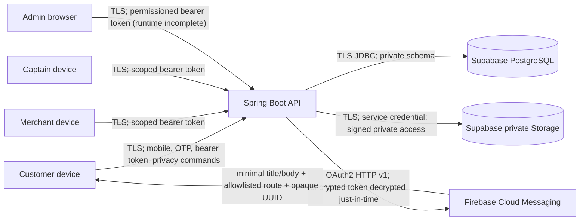

# Actual data-flow map

Status: derived from repository source on 2026-08-15. Dashed/planned services are not represented as operational facts.

## Trust boundaries



Role clients never directly query application tables or hold a Supabase service-role key. The backend is the authorization and transaction boundary.

## Implemented flows

### OTP identity and session

```mermaid
sequenceDiagram
    participant C as Customer app
    participant A as API
    participant O as OTP provider port
    participant D as Session store
    C->>A: mobile + purpose + device ID
    A->>A: validate; hashed rate keys; cooldown
    A->>O: challenge ID + mobile + one-time code
    O-->>C: SMS (production adapter absent)
    C->>A: challenge + mobile + code + adult attestation
    A->>A: salted hash comparison; attempt/expiry/single-use checks
    A->>D: account + hashed refresh token + device/session lineage
    A-->>C: access + refresh token
    C->>C: SecureStore only
```

Cross-border transfer: production SMS provider is not selected; therefore country/region is `UNKNOWN` and launch-blocking. In test/development, the code remains process memory and is never a production route.

### Consent and rights

Customer → Privacy Centre → authenticated `/api/v1/privacy/**` → server-derived Customer ID → `customer_profile`, `privacy_consent`, `privacy_rights_request`. Requests do not accept `customerId` or `userId`. Another Customer's request UUID returns not found. No rights content is sent to a processor beyond the configured PostgreSQL host.

### Account deletion

Customer confirmation → authenticated self endpoint → account disabled → every session revoked → every FCM registration revoked and encrypted token blanked → profile/email/name/adult-attestation erased → active consent withdrawn → cart/lines deleted → mobile replaced with a non-phone tombstone → order/POS/loyalty/audit foreign-key references remain pseudonymous for legal review → deletion tombstone prevents backup restore/re-login. Backups must apply tombstones after restoration before serving traffic.

### Device registration and push

Native FCM token → role app → authenticated device API → ownership lock → AES-GCM protected token + short fingerprint in PostgreSQL → notification worker → Firebase HTTP v1 → minimal notification. Logout calls unregister and server session revocation also revokes the session's registration. Invalid provider tokens are deactivated by the worker. Firebase project location/retention is `UNKNOWN`.

### Commerce and loyalty

Customer cart/quote/order commands → backend in-memory Sprint 1 services in test/development → API DTO. Flyway defines future PostgreSQL records, but most commerce repositories/outbox transactions are not production-wired. Merchant access intersects token outlet scope. Loyalty is scoped by Customer and merchant organisation. No Cashfree call exists.

### Provider documents

Merchant/Admin-authorized upload → backend validation → Supabase private bucket → metadata row. Download → permission check → short-lived signed URL. Actual bucket policy/region evidence is not available.

## Explicitly absent flows

- No direct app → Supabase domain-table flow.
- No Customer address or GPS collection; no location permission request/background tracking.
- No Cashfree initiation/webhook; no PAN/CVV/UPI PIN model.
- No Redis, analytics/advertising, maps, email or production OTP adapter.
- No veterinary booking/medical record/prescription flow.
- No Captain delivery assignment/customer detail endpoint.

These are blockers or future-change triggers, not assumed processors.

## Cross-border register linkage

Potential foreign processing exists for Firebase and Expo/EAS; it is not deemed unlawful or India-only by assumption. It remains undocumented until region, data, retention, subprocessor and contract evidence is entered in `DATA_PROCESSOR_REGISTER.md`. Core production PostgreSQL and applicable ICT logs have an internal India-region preference; CERT-In log jurisdiction is a mandatory deployment gate.
