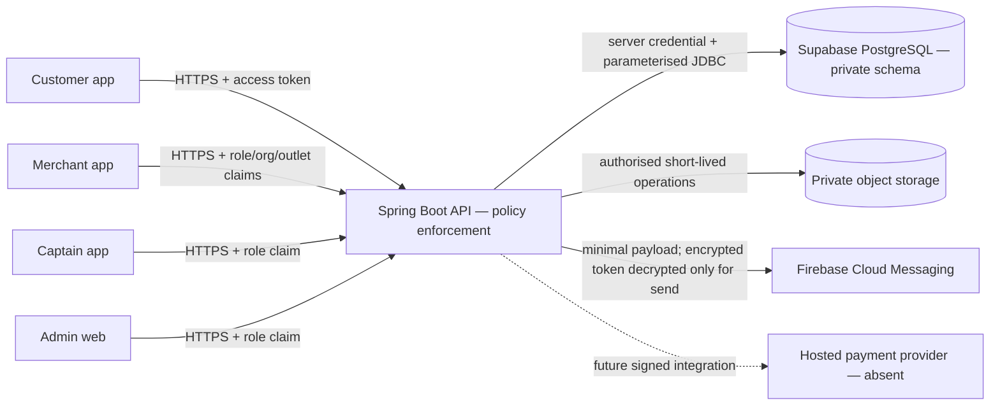

# Security architecture

Status: source-backed architecture, 2026-08-15. It describes implemented code and explicit deployment assumptions; it does not certify a production environment.

## Trust boundaries

Mobile/web clients are untrusted. The API is the sole domain policy boundary: it authenticates tokens, derives actor/role/organisation/outlet scope server-side and maps DTOs. Clients do not directly access PostgreSQL domain tables or privileged storage. Redis, when introduced, is cache/rate/lock/GEO acceleration only and cannot establish business authority.

## Implemented controls

- OTP challenges use salted SHA-256 verification values, a hashed mobile rate key, five-attempt cap, five-minute expiry and resend cooldown. Production durable state and SMS provider are absent.
- Access tokens expire after 15 minutes; refresh tokens are random, stored as hashes and rotated on use. Reuse revokes all account sessions and device tokens. Logout/account deletion revoke and erase device token material.
- Roles are allowlisted. Customer privacy resources bind to the authenticated actor; merchant endpoints require token organisation/outlet scope; tests exercise cross-user and cross-merchant denial. Captain delivery resources are not built.
- PostgreSQL uses Flyway schema, constraints, parameterised JDBC and transactions. Domain tables are not exposed by a client Supabase SDK.
- FCM tokens are AES-GCM protected at rest; only a short fingerprint supports lookup. Customer registration requires active notification consent; withdrawal/logout/deletion revoke and blank token material. Registration/unregistration is owner-bound. Payload routes and resource IDs are allowlisted; lock-screen content rejects sensitive patterns.
- Storage is private by code contract and uses permission checks plus short-lived signed access. Deployed bucket policy/region tests are pending.
- Customer access/refresh tokens use native protected storage; logout unregisters push state before local secret deletion. Runtime production configuration rejects non-HTTPS API URLs.
- CI validates wrapper/dependencies, scans secrets and restricted source patterns, runs unit/contract tests, coverage, type/lint and builds. Two High and one Moderate time-bounded transitive build-time advisory exceptions remain; current Expo patches are temporarily held by the minimum-release-age policy.

## Secrets and cryptography

Server signing, device-token protection, database and provider credentials must be injected through a managed production secret store; never `EXPO_PUBLIC_*`, source control, CI artifacts or app bundles. Rotation requires overlapping verification where necessary, revocation, audit and rollback. Current repository configuration examples are placeholders; production KMS/HSM, key owner, backup, rotation frequency and evidence are `DEPLOYMENT_BLOCKER`.

TLS is required at the API boundary and production mobile URL guard. Production ingress policy, TLS versions/ciphers, HSTS, certificate automation, database TLS and provider egress controls have no accessible evidence. These remain deployment gates.

## Data and network boundaries

- Core data should use a verified India region where feasible. CERT-In-relevant ICT logs require 180-day storage in Indian jurisdiction. Firebase/Expo transfer facts remain unknown and require contracts/region documentation.
- Admin surface needs phishing-resistant MFA, managed devices where justified, short idle sessions, IP/device anomaly monitoring and privileged action audit. These identity-provider controls are not present in the repository.
- Rate limiting exists only in process for OTP and some service guards. A shared distributed limiter/WAF/abuse service is absent; horizontally scaled production is blocked until installed and tested.
- Every production provider needs allowlisted egress, timeout/retry/idempotency, signed webhook verification where applicable, health monitoring and a breach SLA. Payment/OTP/maps/monitoring adapters are not implemented.

## Logging and monitoring boundary

Production code may not call direct console/stdout logging; CI enforces this. Logs should carry UTC time, trace ID, event code, outcome and non-reversible actor/resource references, never access/refresh/FCM tokens, OTP, mobile/email/address, health/prescription data, exact location or payment credentials. `SensitiveDataRedactor` is a tested final text boundary, but it is not permission to log bodies. A durable structured logger adapter, India-located log sink, anomaly alerts and access audit are still missing and are release blockers.

## Failure posture

Missing production secrets/providers must fail closed; no development OTP or in-memory repository may be enabled in production. If the policy store is unavailable, privileged actions and sends fail rather than accept client assertions. Payment webhooks must be signed/idempotent before state changes. Restore is not complete until account-deletion tombstones are reapplied and negative authorization tests pass.
