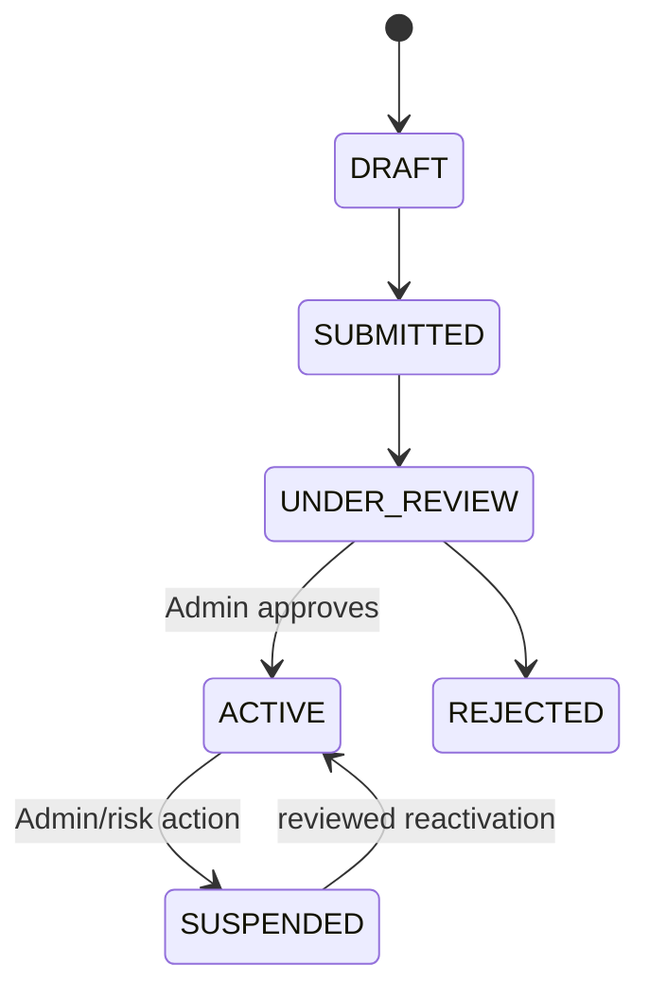
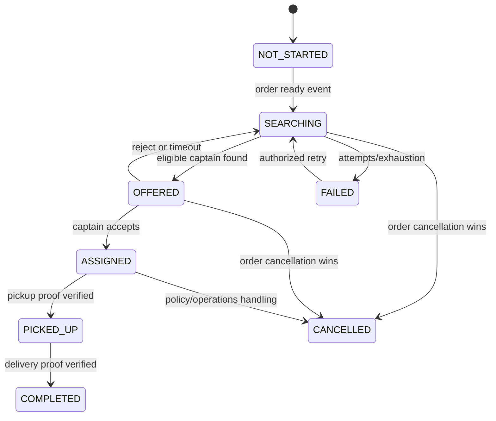
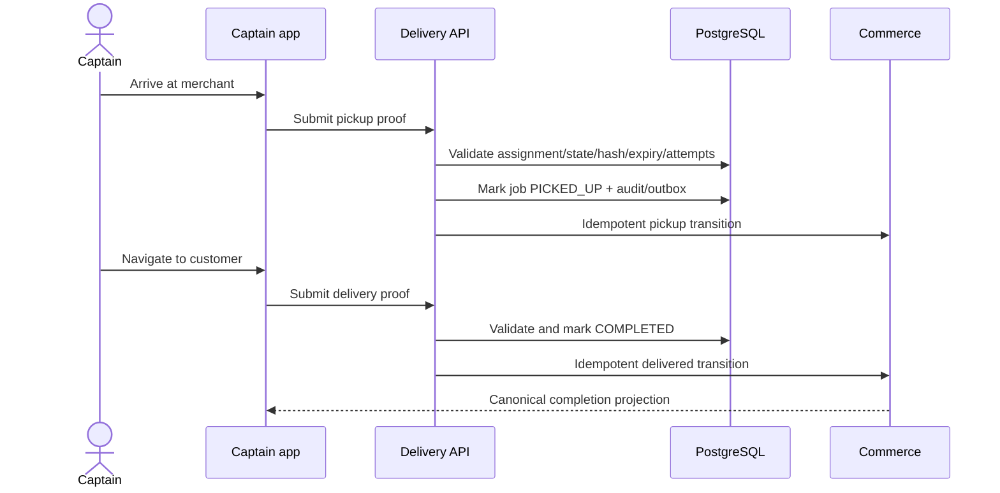
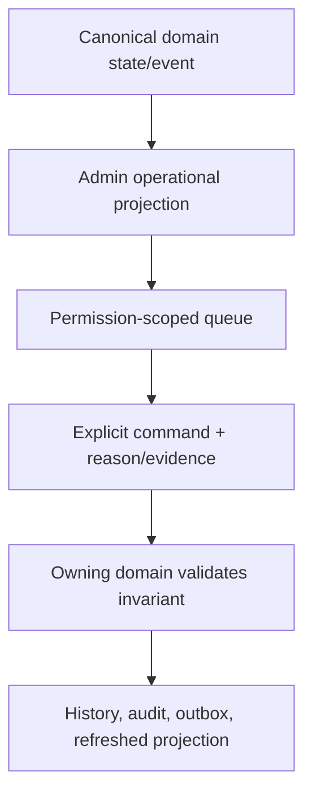
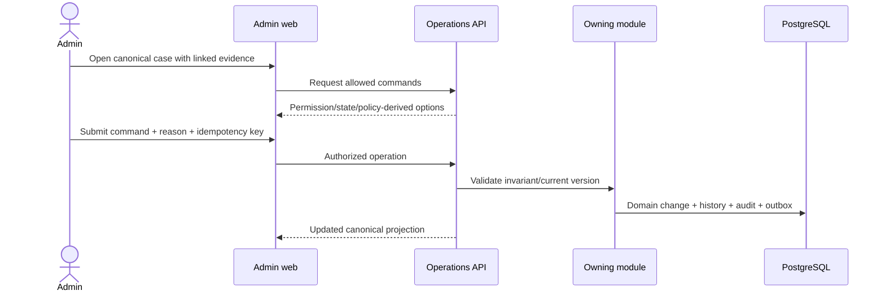

# Captain Delivery and Admin Operations Flow

Status: **Canonical flow contract**  
Related requirements: `CAP-*`, `DSP-*`, `ADM-*`, `PAY-*`, `FIN-*`, `ENG-*`

## 1. Delivery authority invariants

- Commerce owns product-order state; Delivery owns captain/offer/job/proof/location state.
- Dispatch starts only for MyPet delivery when the Merchant moves an accepted order to `READY_FOR_PICKUP`.
- A Captain cannot self-assign, accept an expired/foreign offer, or serve two active deliveries.
- Location is evidence for eligibility/ETA, not authority to change order state.
- Pickup and delivery require separate server-validated proof.
- Admin observes and invokes explicit commands; Admin does not directly rewrite entities.

## 2. Captain activation and availability

Captain state:



Availability is derived:

`ACTIVE approval + online + valid fresh location + no pending accepted offer conflict + no active delivery + required permissions/device state`

The Captain app cannot toggle online if required permission/location checks fail. Offline/sign-out/completion stops location publication.

## 3. Dispatch lifecycle



`FAILED` is a dispatch job condition and operational projection; it must not fabricate an order `CANCELLED` or captain assignment.

## 4. Offer and assignment flow

```mermaid
sequenceDiagram
    participant Commerce
    participant Delivery
    participant DB as PostgreSQL
    participant Redis
    actor Captain

    Commerce->>Delivery: READY event + unique order source
    Delivery->>DB: Upsert one dispatch job
    Delivery->>Redis: Search nearby fresh candidates
    Delivery->>DB: Revalidate eligibility and create expiring offer
    Delivery-->>Captain: Minimal offer notification/context
    Captain->>Delivery: Accept/reject + idempotency key
    Delivery->>DB: Lock offer/job/captain; choose one winner
    Delivery-->>Commerce: Assignment projection/event
```

### Offer race results

| Race | Required winner/result |
|---|---|
| accept vs timeout | exactly one terminal offer effect; loser gets stable conflict |
| two accept requests | one assignment; replay returns same job |
| Captain becomes offline/stale/busy | server revalidation rejects and search continues |
| duplicate ready event | same dispatch job, no second search owner |
| cancellation vs assignment | lock/version policy chooses one; compensation and projections converge |

## 5. Pickup and delivery proof



Proof values/hashes are never returned in job/order DTOs, logs, traces, analytics, crash reports, notifications, or Admin list exports. Wrong attempts are rate-limited and security-monitored.

## 6. Least-privilege context release

| Stage | Captain may see |
|---|---|
| offer | approximate pickup area, estimated distance/earning, package summary without unnecessary customer PII |
| assigned before pickup | merchant name/address/contact policy, navigation, pickup instructions |
| after verified pickup | customer delivery address/contact masking policy, delivery instructions, navigation |
| completed/cancelled | minimal history/earnings/support context; live sensitive details expire according to retention |

Global order/customer lookups are prohibited for Captain.

## 7. Restart and network recovery

1. On app start/sign-in, Captain app fetches canonical availability, open offer, and active job.
2. It resumes the correct state; it never reconstructs from local flags alone.
3. Queued location points are bounded, age-validated, and published only while policy permits.
4. Pickup/delivery command retry uses the original idempotency key.
5. Completion shuts down background tracking even if notification/UI update fails.

## 8. Admin control plane flow



### Admin rule

No generic “Edit status” or “Edit balance” endpoint exists. Examples of valid commands:

- approve/reject/suspend provider/captain;
- retry dispatch search;
- approve/reject refund under policy;
- start payment reconciliation;
- apply double-entry loyalty correction with reason/evidence;
- cancel an eligible order on behalf of a Customer/Merchant with reason;
- resolve support/dispute;
- activate/deactivate city/config/content versions.

Each command requires canonical `ADMIN`, necessary scoped permission, target authorization, current version/state, reason, idempotency key, trace ID, and audit.

## 9. Canonical operational queues

### Product orders

- placed / awaiting merchant;
- accepted;
- preparing;
- ready / dispatch not started;
- searching/offered/assigned;
- dispatch failed;
- picked up;
- delivered;
- rejected/cancelled;
- return/refund exceptions.

### Payments and finance

- pending/processing beyond SLA;
- succeeded without expected order reconciliation;
- failed/expired;
- late success requiring refund;
- refund pending/failed;
- settlement mismatch;
- coupon/reward/loyalty reconciliation issue.

### Services

- holds/hold expiry health;
- booked/awaiting provider;
- upcoming/check-in/in-service;
- cancellation/reschedule/refund exceptions;
- no-show;
- completed/loyalty pending;
- provider closure/suspension impact;
- medicine capability/listing review.

Admin dashboard counts must name time window, time zone, status definition, exclusions, and freshness.

## 10. Refund and repair flow



If a repair cannot preserve invariants through a supported command, Engineering performs a reviewed, scripted repair with dry-run, backup, dual approval, reconciliation, and post-condition evidence. Direct ad hoc production SQL is not an Admin feature.

## 11. Support/dispute evidence

Support case references may link order, appointment, payment, dispatch, POS sale, loyalty entry, reward, or notification. Role DTOs redact fields. Attachments use private storage, type/size/malware validation, signed access, and retention. Internal notes never appear to customers/merchants/captains.

## 12. Required observability

- captain approval/online/location freshness and permission failures;
- dispatch job create/duplicate/search/offer/reject/timeout/assign/fail/retry;
- accept-timeout and cancel-assignment conflict results;
- pickup/delivery proof attempts, lockouts, success latency, and secret-leak scanners;
- background tracking start/stop/restart and stale/invalid coordinate rejection;
- Admin sensitive reads, allowed-command queries, command outcomes, permission denial, and step-up;
- refund/reconciliation/repair duration and mismatches;
- queue age/SLA and projection lag;
- trace from Merchant ready event through dispatch, proofs, delivered order, settlement, and loyalty.

