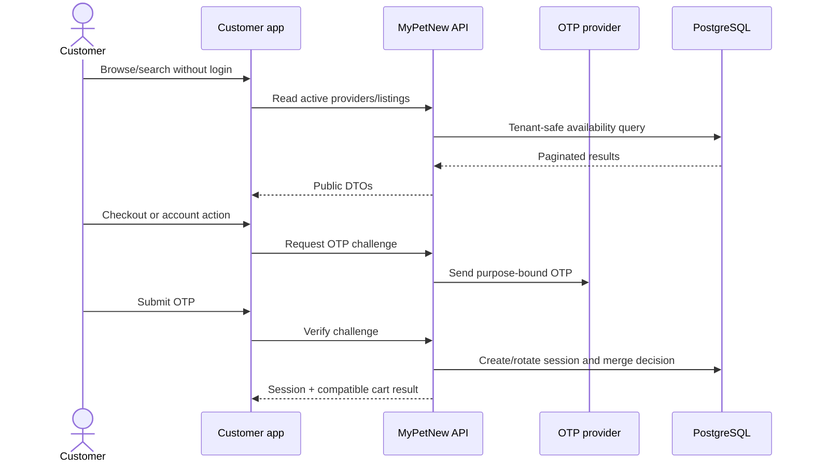
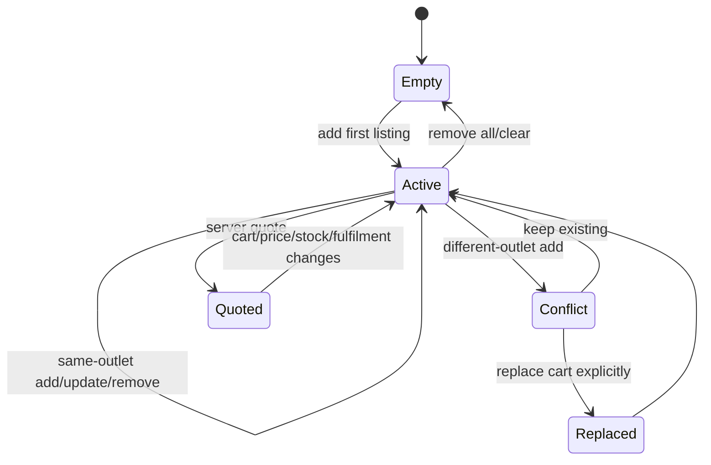
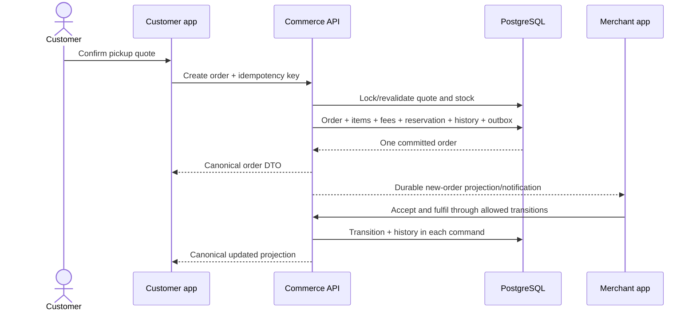
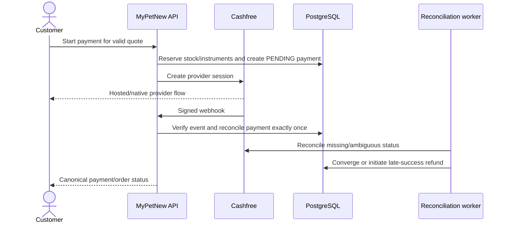
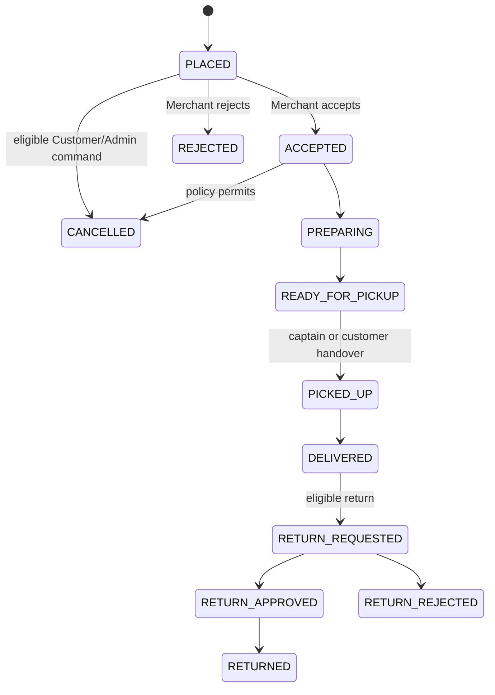

# Customer Commerce Flow

Status: **Canonical flow contract**  
Related requirements: `CUS-*`, `ORD-*`, `PAY-*`, `FIN-*`, `LOY-*`, `REC-*`

## 1. Flow invariants

- Browsing is public; account-specific and transactional actions require verified mobile OTP.
- A cart belongs to one Customer/guest session and exactly one merchant outlet.
- The server owns listing availability, price, fees, discounts, tax, stock, serviceability, coupon/reward validity, and totals.
- Quote, order, payment, inventory, coupon/reward, and loyalty are separate entities with explicit relationships.
- Payment success never advances Merchant fulfilment.
- Customer, Merchant, Captain, and Admin read projections of one canonical order.

## 2. Guest discovery and authentication



### Failure branches

| Condition | Required result |
|---|---|
| unknown mobile | response does not disclose whether an account exists |
| OTP request abuse | stable rate-limit error and safe retry time; no OTP logged |
| expired/replayed OTP | verification fails without issuing a session |
| guest/auth carts use same outlet | quantities merge within stock limits and audit records source |
| carts use different outlets | no automatic merge; Customer chooses keep existing or replace |
| Merchant suspended during browse | listing disappears from new reads; stale detail cannot transact |

## 3. Single-merchant cart



The client must display merchant identity before replacement. A malicious client posting multiple merchant IDs receives `CART_MULTIPLE_OUTLETS` and no partial mutation.

## 4. Quote flow

1. Customer selects cart items and fulfilment mode.
2. For MyPet delivery, Customer selects a saved/new address and six-digit PIN code; the outlet must actively serve it.
3. For store pickup, delivery address/PIN serviceability is not required; outlet pickup must be enabled.
4. API reloads active outlet/listings/variants/stock and validates quantity.
5. API evaluates normal coupon and loyalty reward independently, then validates allowed stacking.
6. API calculates integer-paise breakdown, ₹10 customer platform fee, delivery charge where applicable, and merchant commission ledger component.
7. API creates a short-lived quote bound to customer, cart signature, outlet, fulfilment, address when relevant, pricing-rule versions, and eligible instruments.
8. Client renders the server breakdown unchanged.

### Quote response minimum

```json
{
  "quoteId": "opaque-id",
  "outlet": { "id": "opaque-id", "name": "Example" },
  "items": [],
  "fulfilmentMode": "STORE_PICKUP",
  "pricing": {
    "itemSubtotalPaise": 0,
    "itemDiscountPaise": 0,
    "couponDiscountPaise": 0,
    "loyaltyRewardPaise": 0,
    "taxPaise": 0,
    "platformFeePaise": 1000,
    "deliveryFeePaise": 0,
    "grandTotalPaise": 0,
    "currency": "INR",
    "ruleVersion": "v1"
  },
  "expiresAt": "ISO-8601"
}
```

Merchant commission is not added to the customer total; it is snapshotted into finance/settlement.

## 5. Sprint 1 pickup/pay-on-fulfilment checkout



### Sprint 1 payment semantics

- Method: `PAY_ON_FULFILMENT`.
- Payment state: `NOT_REQUIRED` or `PENDING_EXTERNAL_COLLECTION` according to final schema naming, never `SUCCEEDED` before collection declaration.
- Customer platform fee remains part of amount due.
- Merchant commission is accounted at completion/settlement.
- Order creation reserves stock; cancellation/rejection releases it once.

## 6. Online payment flow (Sprint 2)



### Forbidden behavior

- Customer app callback cannot mark payment successful.
- A payment provider success cannot accept the order on behalf of Merchant.
- Retrying payment cannot create a new order when an eligible existing order/payment attempt should be reused.
- A late captured payment cannot resurrect a cancelled/expired order.

## 7. Canonical order state flow



For store pickup, verified customer handover may project `PICKED_UP` and immediately/explicitly complete `DELIVERED` according to the pickup command. The system must still write both canonical history effects or an approved atomic pickup-completion transition with equivalent audit semantics.

## 8. Customer cancellation and refund

1. Customer asks for eligibility; server returns allowed action, deadline, reason policy, refund estimate, and consequences.
2. Customer confirms with an idempotency key and selected reason.
3. Commerce locks order and validates current state/version.
4. Cancellation appends history and emits durable effects.
5. Inventory reservation is released once.
6. Coupon/reward reservation is released or redeemed value is reconciled according to policy.
7. If payment succeeded, Payment creates one refund request and provider reconciliation owns terminal refund state.
8. Loyalty reversal happens only if an eligible source star already exists.
9. All role projections update from canonical events.

Cancellation-vs-accept/payment/dispatch races must return a deterministic winner and stable conflict result to the loser.

## 9. Reorder

Reorder never clones the old total, price, coupon, reward, stock, PIN serviceability, merchant status, or payment. It creates a new cart proposal from current eligible listings and explains missing/changed items. A reorder remains single-merchant.

## 10. Customer tracking projection

The Customer tracker derives presentation steps from order + dispatch without writing new business states:

| Canonical condition | Customer label |
|---|---|
| `PLACED` | Order placed; awaiting merchant |
| `ACCEPTED` | Merchant accepted |
| `PREPARING` | Preparing |
| `READY_FOR_PICKUP`, no assignment | Finding a captain / ready for pickup |
| assigned offer/accepted | Captain assigned |
| `PICKED_UP` | On the way / ready for customer pickup context |
| `DELIVERED` | Delivered |
| dispatch failure | Delivery delayed; support/next action shown |

“Arriving” may be a UI phrase using ETA but is not persisted as an order status.

## 11. Required observability

- checkout attempts and stable failure codes;
- quote expiration/stale-cart/stock conflicts;
- idempotency replay and fingerprint mismatch;
- order transition latency and conflicts;
- payment session/webhook/reconciliation/refund metrics;
- inventory reservation/release mismatches;
- coupon/reward reservation/release/redemption mismatches;
- cross-merchant cart conflict rate;
- trace link from customer action through order, payment, outbox, and merchant projection.

