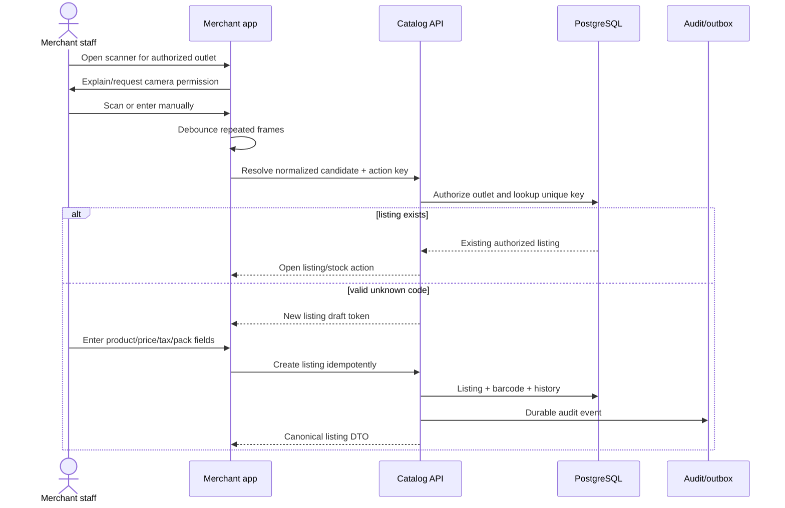
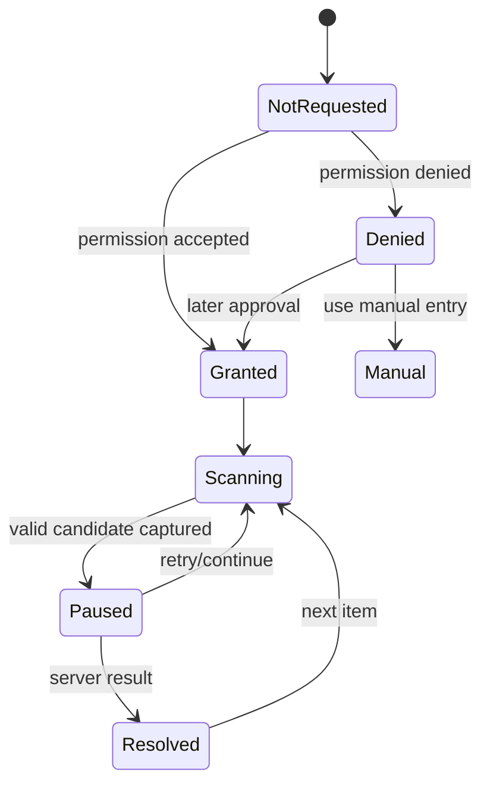
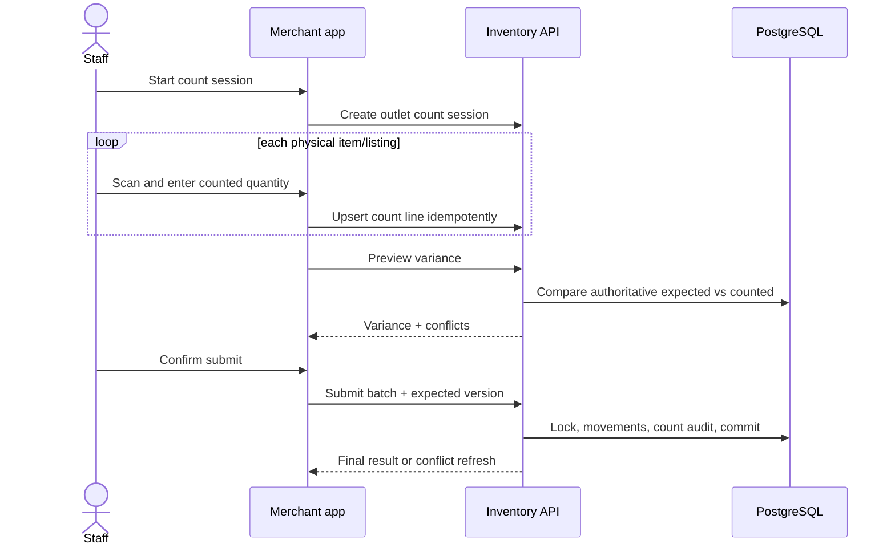
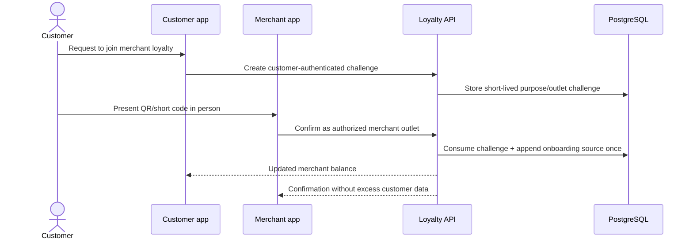
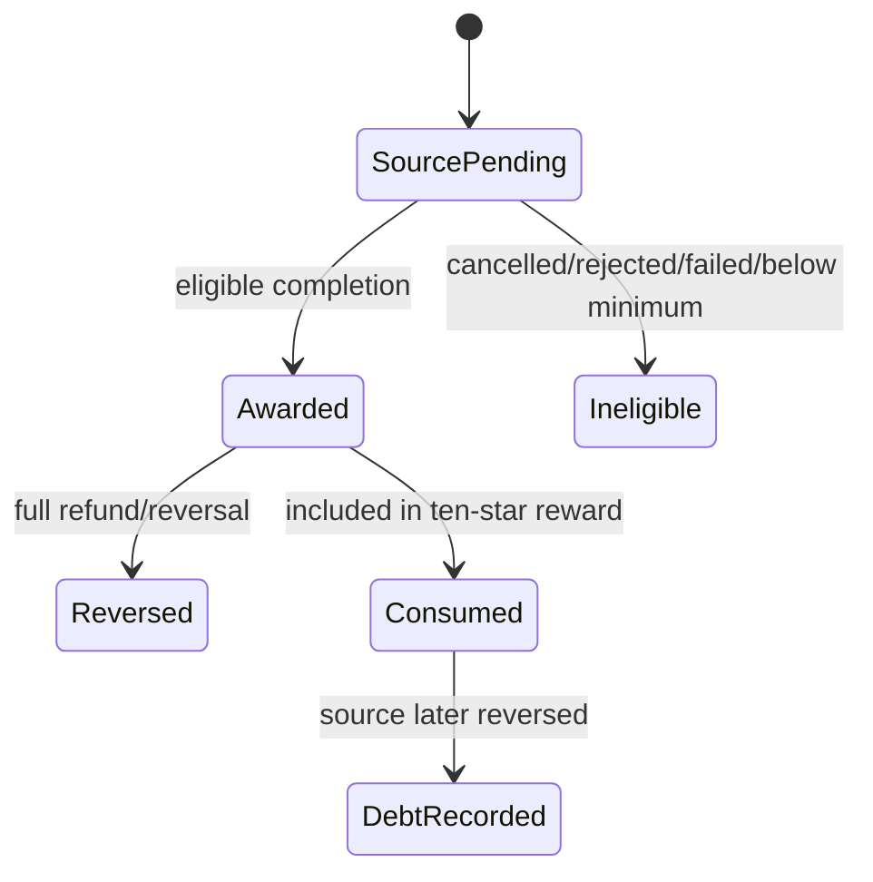
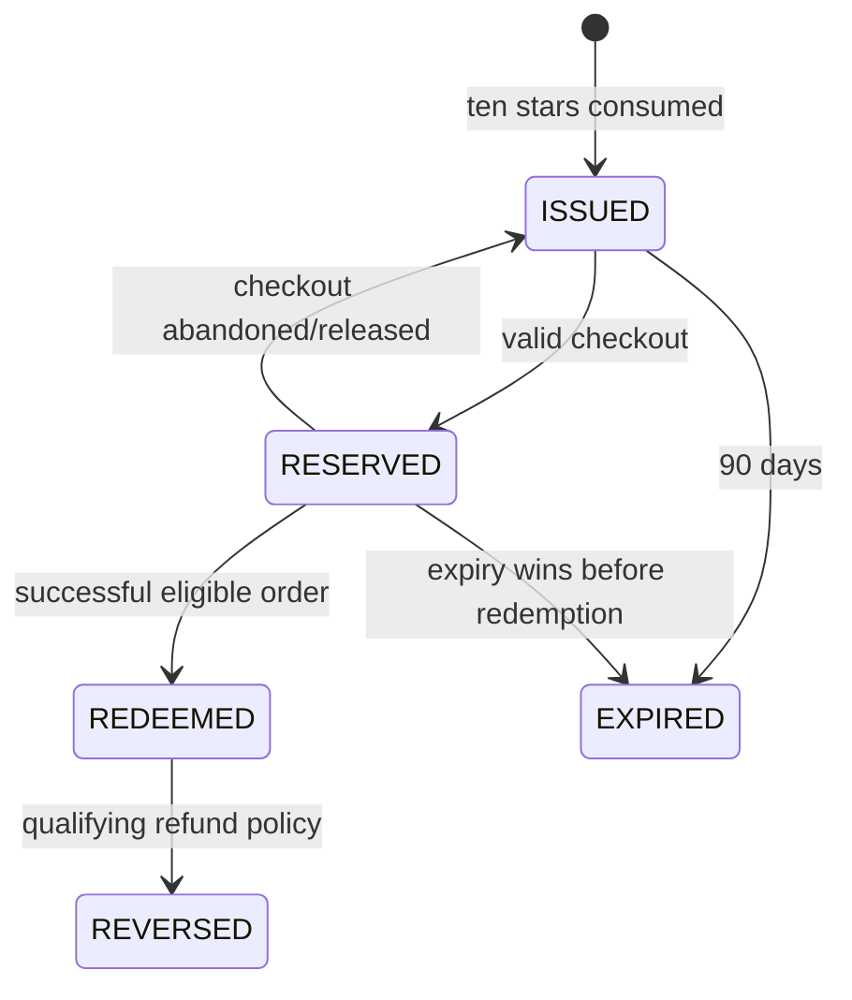

# Merchant Barcode, POS, Inventory, and Loyalty Flow

Status: **Canonical flow contract**  
Related requirements: `CAT-*`, `BAR-*`, `INV-*`, `POS-*`, `LOY-*`

## 1. Ownership invariants

- A barcode resolves only within the authenticated Merchant's authorized outlet.
- The same normalized barcode may be listed by another merchant without linking price, stock, or ownership.
- Within one outlet, barcode type + normalized value is unique.
- Barcode data is an identifier, never trusted price, tax, stock, batch, staff, or customer data.
- Inventory is an append-only movement ledger; displayed stock is a derived current balance.
- POS completion and loyalty effects are atomic/recoverable and idempotent.

## 2. Barcode types and normalization

| Type | Validation | Stored value |
|---|---|---|
| `GTIN_8` | 8 digits + valid GS1 check digit | 8 digits |
| `UPC_A` / `GTIN_12` | 12 digits + valid check digit | 12 digits |
| `EAN_13` / `GTIN_13` | 13 digits + valid check digit | 13 digits |
| `GTIN_14` | 14 digits + valid check digit | 14 digits |
| `INTERNAL` | merchant-configured safe pattern/length | normalized uppercase value |

Permitted visual separators may be stripped before validation. Leading zeros are preserved. Scientific notation, floating-point parsing, whitespace-only values, control characters, overlong payloads, and unsupported symbologies are rejected.

## 3. Product onboarding by scan



### Duplicate behavior

| Situation | Result |
|---|---|
| same frame delivered repeatedly | one local resolve attempt within debounce window |
| same action retried after timeout | same response/effect from idempotency record |
| code already exists in outlet | return existing listing; no duplicate |
| same code exists at another merchant | allow independent listing; leak no foreign merchant details |
| code belongs to view-only medicine | listing may be created only with verified capability and forced `VIEW_ONLY` |

## 4. Scanner permission and device flow



Permanent denial shows settings recovery. The scanner does not loop permission prompts or silently substitute fake scan values.

## 5. Inventory receiving and counting

### Receive stock

1. Staff scans/chooses listing.
2. App displays live outlet listing and current stock.
3. Staff enters positive quantity and optional batch/expiry/reference.
4. API authorizes staff permission, validates listing/outlet and batch fields, and writes one `RECEIPT` movement by idempotency key.
5. Response returns movement and resulting quantity.

### Stock count



Count submission is one idempotent batch. Concurrent sales/reservations either participate in a defined cut-off snapshot or cause a conflict; they must not be silently overwritten.

## 6. POS sale

```mermaid
sequenceDiagram
    actor Cashier
    participant App as Merchant app
    participant API as POS API
    participant DB as PostgreSQL
    participant Loyalty as Loyalty module

    Cashier->>App: Scan item(s)
    App->>API: Resolve outlet listing
    API->>DB: Read live price/available stock
    API-->>App: Canonical POS line
    Cashier->>App: Associate consenting customer
    App->>API: Verify customer challenge/OTP
    Cashier->>App: Select payment declaration and complete
    App->>API: Complete sale + idempotency key
    API->>DB: Lock stock; sale/items/movements/outbox
    API->>Loyalty: Record eligible source atomically or via inbox
    Loyalty->>DB: Append one ledger effect
    API-->>App: Receipt + loyalty outcome
```

### POS rules

- Every line is reloaded and priced by server at completion.
- Anonymous sale is supported but earns no customer star.
- Customer association is consent-bound and cannot reveal balance from a typed phone number alone.
- `CASH`, `EXTERNAL_UPI`, and `CARD_TERMINAL` are declarations; they do not create a Cashfree success.
- View-only medicine is blocked by server, even for a verified medicine-catalog outlet in Version 1.
- Last-unit competition with online reservation has one database-ordered winner.
- Duplicate completion returns the same sale/receipt.

## 7. Merchant-verified onboarding star



The challenge is single-use, short-lived, customer/merchant/outlet/purpose-bound, rate-limited, and non-transferable. A merchant cannot grant a star by entering a phone number.

## 8. Loyalty source and reward lifecycle





### Exactly-once source keys

Examples:

- `ONBOARDING:{customerId}:{merchantOrgId}`
- `POS_SALE:{saleId}`
- `ORDER_DELIVERED:{orderId}`
- `GROOMING_COMPLETED:{appointmentId}`
- `VET_COMPLETED:{appointmentId}`
- reversal references the original ledger entry and reversal event ID.

The database enforces source uniqueness. Event consumers also maintain inbox uniqueness. Both layers are required.

## 9. Ten-star conversion

1. Award command appends the eligible star.
2. Within the same locked customer/merchant ledger operation, calculate available non-debt stars.
3. Settle existing star debt before growing available balance.
4. For each complete block of ten, append ten consumption references and create one flat-value reward using the merchant configuration version effective at issuance.
5. Preserve remainder stars.
6. Set reward expiry to 90 days from issuance.
7. Emit one deduplicated notification.

Concurrent tenth-star sources must never issue two rewards from the same ten stars.

## 10. Refund and debt

- Full reversal of an unconsumed awarded star appends one negative/reversal entry.
- If the star was consumed but reward is unused, policy may cancel/recompute the reward only through an explicit audited command.
- If the reward was redeemed or otherwise cannot be safely cancelled, append `STAR_DEBT`.
- Future eligible awards first reduce debt and explain the outcome to Customer/Merchant support views.
- No history row is edited or deleted.

## 11. Required observability

- scan resolution latency, permission denial, manual fallback, invalid checksum, duplicate and unknown rate;
- offline queued action age/replay/conflicts;
- inventory movements by reason, negative-stock prevention conflicts, count variance;
- POS completion/replay/failure and declared payment mix;
- customer-association challenge create/consume/expire/abuse;
- loyalty source accepted/duplicate/ineligible/reversed/debt;
- ten-star reward issue/concurrency/expiry/reservation/redemption;
- trace links from scan/POS sale to movement, ledger, receipt, and notification.

