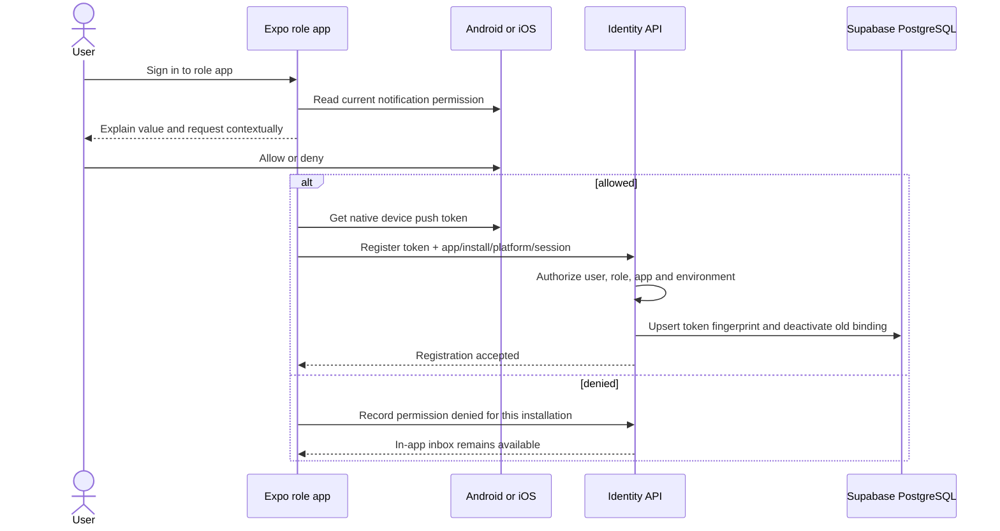
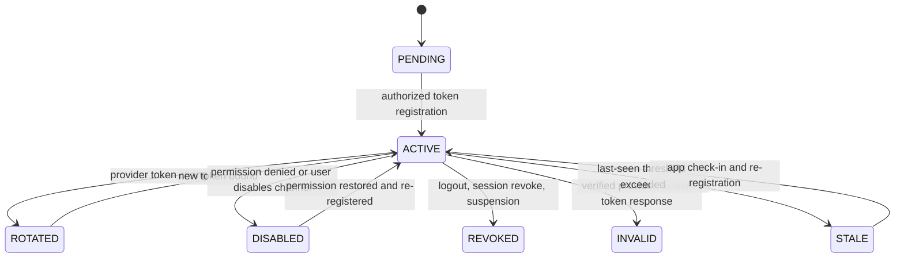

# Notification Delivery Flow

Status: **Canonical flow contract**  
Related requirements: `NOT-*`, `DAT-*`, `ENG-*`, `DD-013`, `DD-014`

## 1. Authority and privacy invariants

- A committed business transition plus its outbox record is the notification source; Firebase is only a delivery provider.
- Push acceptance, display, tap, receipt, retry, denial, or failure never changes order, payment, stock, appointment, dispatch, POS, loyalty, support, or identity state.
- The Customer, Merchant, and Captain apps obtain native device tokens through `expo-notifications`. They never possess FCM server credentials.
- A token is bound to exactly one environment, role app, installation, platform, authenticated user/role, and active session context at a time.
- Payloads contain no OTP, access token, full phone, address, medical detail, payment proof, delivery proof, support evidence, or authoritative status/money value.
- Every deep link is allowlisted and re-authorized at open time. The app fetches canonical current state from the MyPetNew API.
- An in-app notification projection is available even when OS permission is denied, a token is stale, or FCM is unavailable.

## 2. Environment and app registration

| Environment | Firebase project | Registered apps | Permitted backend |
|---|---|---|---|
| development | dedicated development project | Customer, Merchant, Captain dev package/bundle IDs | development backend only |
| staging | dedicated staging project | Customer, Merchant, Captain staging package/bundle IDs | staging backend only |
| production | dedicated production project | Customer, Merchant, Captain production package/bundle IDs | production backend only |

Android uses FCM v1 credentials for its environment. An iOS build additionally requires the corresponding APNs key/certificate configuration in Firebase. Admin browser push is outside Version 1; Admin receives in-app operational alerts until a separate web-push decision is approved.

## 3. Permission and token registration



Registration is idempotent. The raw token is encrypted or otherwise protected at rest; logs, analytics, traces, error bodies, and Admin screens use only a bounded fingerprint. The app repeats registration after login, token refresh, reinstall/restore detection, permission change, or environment/build change.

### Device-registration lifecycle



History is retained for audit and debugging, but only `ACTIVE` registrations are eligible for send. Logout revokes the session-bound registration on the server even if the app cannot contact FCM.

## 4. Transactional push delivery

```mermaid
sequenceDiagram
    participant Domain as Owning domain
    participant DB as Supabase PostgreSQL
    participant Worker as Notification worker
    participant FCM as Firebase FCM
    participant App as Target role app
    participant API as MyPetNew API

    Domain->>DB: Business state + history + outbox in one transaction
    Worker->>DB: Claim event and resolve authorized recipients
    Worker->>DB: Create inbox item + channel attempt by dedupe key
    Worker->>FCM: HTTP v1 send with safe payload
    alt accepted
        FCM-->>Worker: Message/provider reference
        Worker->>DB: Record accepted attempt
        FCM-->>App: Deliver when device is reachable
        App->>API: Open allowlisted route with opaque resource ID
        API-->>App: Authorized canonical current DTO
    else transient failure
        FCM-->>Worker: Retryable error
        Worker->>DB: Backoff schedule; bounded attempts
    else invalid token
        FCM-->>Worker: Permanent token error
        Worker->>DB: Mark registration invalid; no retry to token
    else poison/config failure
        Worker->>DB: Dead letter + alert + retained inbox item
    end
```

The dedupe key is at minimum `source_event_id + recipient_id + channel + template_version`. Provider retries reuse the same logical attempt identity. Multiple active installations for one user may each receive one device delivery while the user has one in-app notification item.

## 5. Sprint 1 notification slice

Sprint 1 must implement and prove:

1. Customer, Merchant, and Captain app registration contracts, with physical Android evidence for at least Customer and Merchant;
2. a Merchant push/in-app item after a Customer places a pickup order;
3. a Customer push/in-app item after an associated eligible POS sale awards a loyalty star;
4. safe foreground, background, killed-state, notification-tap, and protected deep-link handling;
5. token rotation, logout/session revocation, permission denial, invalid-token cleanup, provider outage retry, dedupe, and dead-letter visibility;
6. environment isolation and absence of Firebase server secrets from source/client artifacts;
7. proof that push failure leaves the originating order, sale, inventory, and loyalty state unchanged.

All later transactional notification types reuse this spine; Sprint 9 adds full template/preference/inbox operations and channel coverage.

## 6. Event-to-route contract

| Event family | Recipient | Safe route intent | API authorization at open |
|---|---|---|---|
| pickup order placed | outlet-authorized Merchant staff | Merchant order detail | active Merchant session, outlet scope, order ownership |
| order transition | Customer; relevant Merchant staff | role-specific order detail | current actor owns/is authorized for order |
| eligible POS loyalty star | associated Customer | merchant loyalty detail | Customer owns relationship; Merchant detail is public-safe |
| loyalty reward/expiry | Customer | merchant loyalty/reward detail | Customer owns reward; current validity is server-computed |
| captain offer/dispatch | targeted Captain | offer/delivery detail | Captain is intended candidate/assignee and offer remains valid |
| appointment transition | Customer; outlet staff | role-specific appointment detail | actor owns/is assigned to appointment/provider outlet |
| recurring proposal | Customer | renewal proposal detail | Customer owns active proposal; server recomputes before confirm |
| support update | case participant | support case detail | actor remains an authorized participant/staff member |

A stale notification may legitimately open a newer terminal state. The client shows the fetched state, not the old push body, and must never replay the historical action automatically.

## 7. Failure and abuse handling

| Condition | Required result |
|---|---|
| OS permission denied | no repeated coercive prompt; record preference; in-app inbox/API still works |
| app uses token from another role or environment | registration rejected and security-observed; no binding created |
| token rotates | new token becomes active and old token becomes ineligible atomically/idempotently |
| logout/session revocation | matching registrations become ineligible before any later send |
| duplicate domain/outbox event | one logical inbox item and one logical send per eligible device |
| provider throttling/outage | bounded exponential retry with jitter; backlog/age alert; domain state untouched |
| invalid/unregistered token | deactivate exact binding based on verified provider response; do not retry it |
| malformed/unknown route | notification may be recorded, but app opens safe inbox/home and reports contract error |
| wrong user/role taps a copied link | API denies without target existence leakage; no cached sensitive content shown |
| compromised payload inspection | only opaque IDs and safe presentation text are visible; secrets/PII absent |
| outdated status in push | app fetches and renders current canonical state; no old action is applied |

## 8. Observability and runbook minimum

Measure by environment, app, template version, event family, and safe provider result:

- outbox-to-attempt latency, backlog depth/age, attempts, accepted, invalid, retrying, and dead-letter counts;
- active/disabled/revoked/invalid/stale registration counts and token-rotation rate;
- deep-link open and authorized-fetch success without recording sensitive route parameters;
- notification dedupe conflicts and unexpected cross-environment/app registration attempts;
- provider credential/config expiry and delivery degradation alerts.

Runbooks cover FCM credential failure/rotation, APNs configuration expiry, mass invalid-token response, backlog replay, template rollback, wrong-environment build, and safe provider disablement. Replay must not create duplicate domain effects or duplicate logical notifications.
