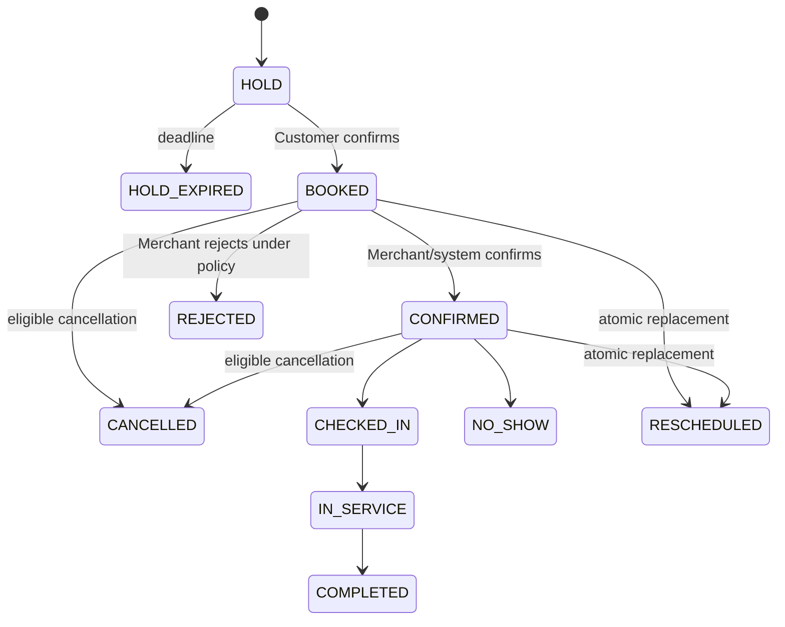
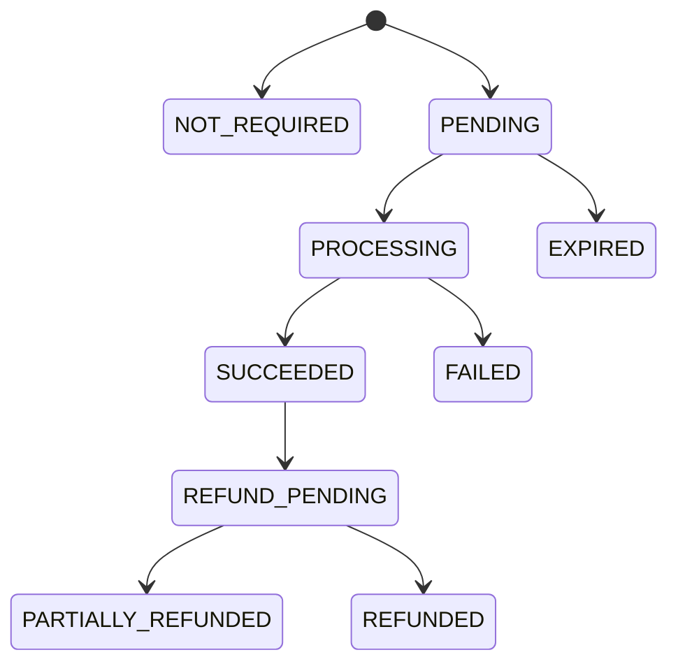
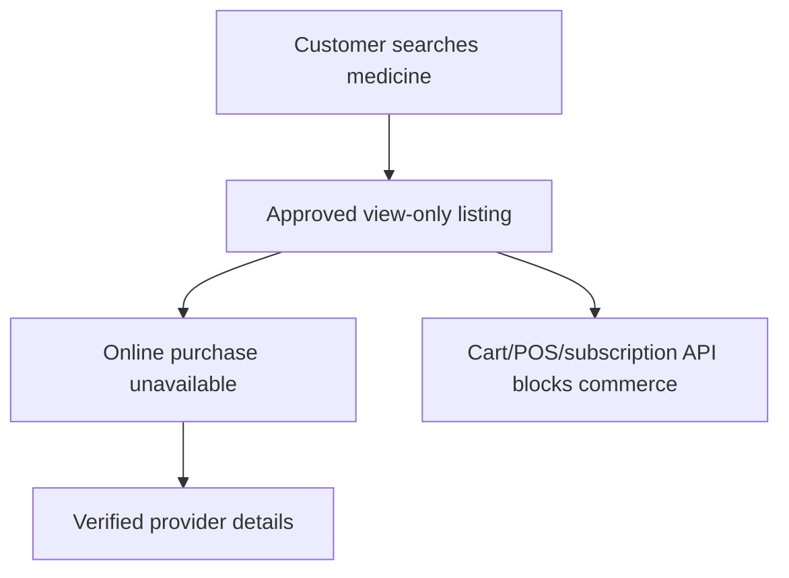
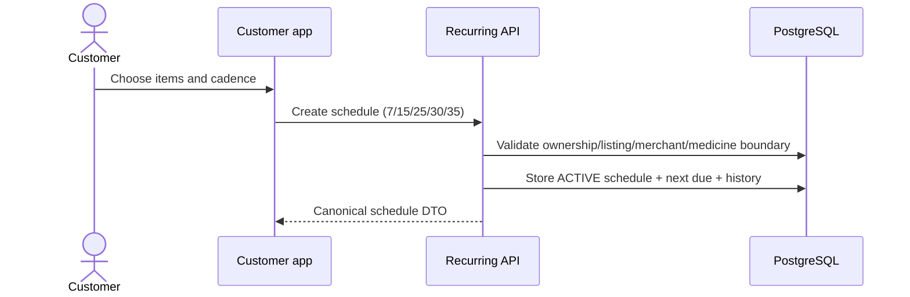
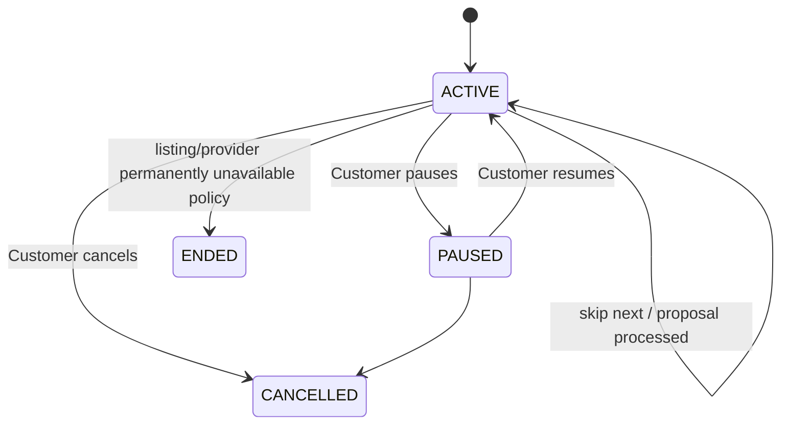
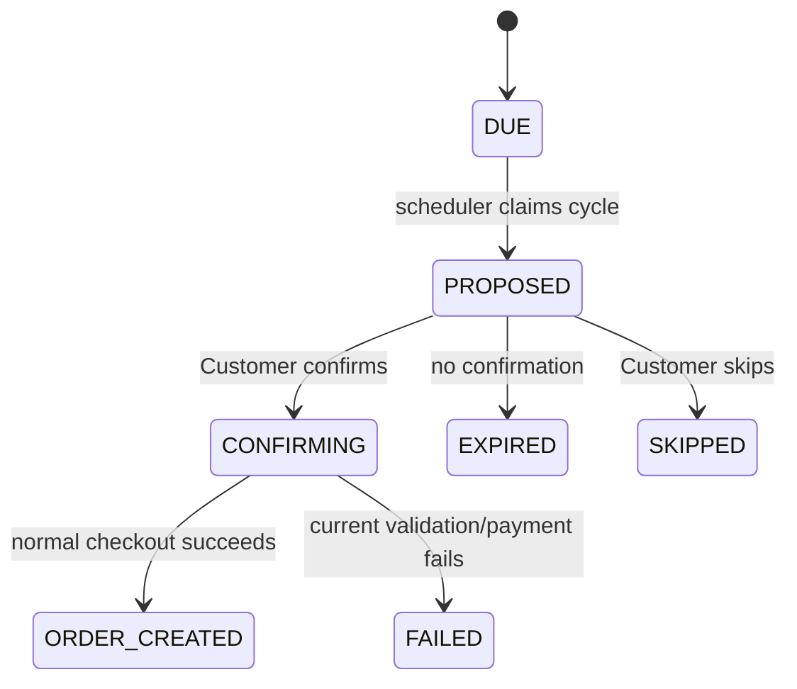
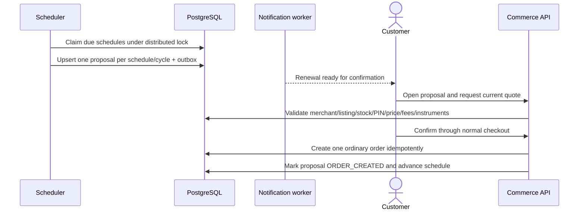

# Services, Medicine Discovery, and Recurring-Order Flow

Status: **Canonical flow contract**  
Related requirements: `SRV-*`, `MED-*`, `REC-*`, `LOY-*`, `PAY-*`

## 1. Service invariants

- Only active, capability-verified outlets publish/book the corresponding service.
- Availability is server-generated and slot holds are atomic.
- Appointment state and payment state are independent.
- A grooming/veterinary star is awarded only at `COMPLETED`, never `BOOKED`, `CONFIRMED`, or `PAID`.
- Medical context is purpose-limited and role-safe.
- Medicine discovery cannot become commerce through any API or client bypass in Version 1.

## 2. Service discovery and slot hold

```mermaid
sequenceDiagram
    actor Customer
    participant App as Customer app
    participant API as Appointment API
    participant DB as PostgreSQL
    participant Merchant as Merchant app

    Customer->>App: Select provider/offering/pet/date
    App->>API: Request current availability
    API->>DB: Compute from hours/staff/resources/bookings/holds
    API-->>App: Available slots + policy/price
    Customer->>App: Select slot
    App->>API: Create idempotent slot hold
    API->>DB: Lock capacity and create expiring hold
    API-->>App: Hold token + expiry + price snapshot
    Customer->>App: Confirm booking/payment choice
    App->>API: Confirm hold
    API->>DB: Appointment + history + outbox; consume hold
    API-->>Merchant: Durable new appointment projection
```

### Hold failure behavior

| Condition | Result |
|---|---|
| two Customers select final slot | one hold succeeds; other receives conflict and fresh alternatives |
| duplicate hold request | same hold returned for matching request fingerprint |
| hold expires during confirmation | no booking/payment initiation; Customer selects again |
| payment starts then hold expires | compensation/reconciliation policy prevents orphan success; late success refunds |
| provider closes/suspends | new holds blocked; existing appointments enter explicit operational handling |

## 3. Appointment state machines

### Business state



### Payment state



`SUCCEEDED` payment does not set appointment to `CONFIRMED`, `IN_SERVICE`, or `COMPLETED`.

## 4. Reschedule

1. Customer/Merchant requests eligibility for the current appointment and actor.
2. API returns policy, charges/refund estimate, and available alternatives.
3. Actor selects a new slot and creates a hold.
4. Reschedule command locks appointment and both old/new capacity records.
5. If all checks pass, new slot is consumed, appointment history records old/new schedule, and old capacity releases.
6. If any step fails, the original appointment remains intact and new hold expires/releases.
7. Notifications are emitted once.

Reschedule never releases the old slot before the new slot is committed.

## 5. Appointment completion and loyalty

```mermaid
sequenceDiagram
    actor Staff as Authorized provider staff
    participant API as Appointment API
    participant DB as PostgreSQL
    participant Loyalty as Loyalty module
    participant Customer as Customer app

    Staff->>API: Complete in-service appointment
    API->>DB: Validate state/staff/outlet; append COMPLETED
    API->>DB: Write outbox event in same transaction
    Loyalty->>DB: Claim unique completion source
    Loyalty->>DB: Check merchant minimum and append star/reward effect
    Loyalty-->>Customer: Updated merchant loyalty projection
```

Duplicate completion commands/events return the existing result. Cancellation/no-show/rejection/refund policy drives ineligibility/reversal explicitly.

## 6. Veterinary data boundary

- Customer selects which pet is part of the appointment.
- Provider sees only necessary pet/profile/appointment context after authorized booking.
- Clinical notes/prescriptions/documents declare author, provider, appointment, customer/pet, type, creation, retention, and access policy.
- Files use private storage, malware/type/size validation, purpose-bound short-lived signed URLs, and access audit.
- Customer app never fabricates a prescription URL or successful upload.
- Admin access to medical evidence requires explicit permission and purpose/reason audit.

## 7. Medicine discovery



All medicine offerings have `commerceMode=VIEW_ONLY`. A client hiding the label, directly calling checkout, changing the type, using POS, or creating a recurring schedule cannot bypass the server rule.

## 8. Recurring schedule creation

Eligibility source: active merchant-owned non-medicine product listing, commonly from a delivered order/reorder surface.



A schedule records references and quantities, not a guaranteed price, stock, coupon, reward, or payment.

## 9. Recurring lifecycle



Each cycle may have one renewal proposal:



## 10. Scheduler and confirmation flow



### Current-state revalidation

At confirmation, explain/block:

- merchant/outlet inactive or suspended;
- listing/variant inactive, deleted, medicine, or changed;
- insufficient stock or quantity limit;
- changed price/fees/discount/tax;
- delivery PIN no longer serviceable;
- address invalid;
- coupon/reward expired/ineligible;
- Customer not authenticated;
- proposal expired/already confirmed.

No Merchant order is visible until Customer confirmation creates a normal order.

## 11. Calendar rules

- Cadence is a fixed number of elapsed calendar days: 7, 15, 25, 30, or 35.
- Store instants in UTC and retain the Customer's chosen local reminder time zone.
- A skipped cycle advances exactly one cadence from its scheduled due anchor according to documented policy; retry delays do not drift future cadence.
- Pause stops new proposals. Resume calculates next due through explicit UX and server policy; it does not immediately duplicate an already open cycle.
- Scheduler claims are idempotent by `(scheduleId, cycleNumber)`.

## 12. Required observability

- availability query and slot conflict/hold expiry rates;
- appointment transitions, cancellations, reschedules, no-shows, and payment mismatches;
- completion-to-loyalty source latency/duplicates/reversals;
- document access/denial/expiry/security events;
- medicine commerce-block attempts by surface/API;
- due schedules claimed, proposal created/duplicate/expired/confirmed/failed;
- confirmation failure reasons and schedule drift;
- worker lock ownership, lag, retry, and dead-letter state.

