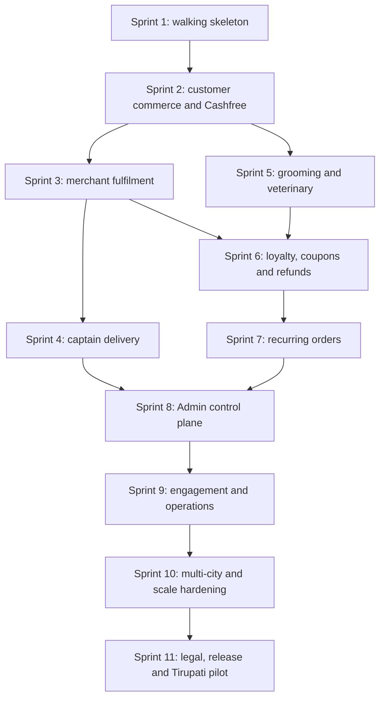
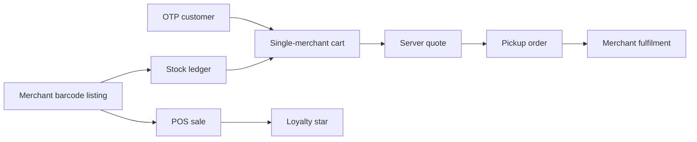

# MyPetNew Sprint Execution Plan

Status: **Execution baseline**  
Version: **1.0**  
Date: **2026-08-11**

## 1. Delivery model

- Default timebox: 10 working days per sprint.
- Exit is evidence-based, not date-based. Incomplete mandatory gates keep a sprint open.
- One vertical slice includes schema, domain, API, role UI, authorization, validation, audit, observability, documentation, and tests.
- Production and demo fixtures are isolated at build/configuration boundaries. Production cannot fall back to demo or mock data.
- Every ticket references PRD IDs and adds/updates traceability.
- Database changes are forward migrations with clean-install and upgrade tests.
- Mobile device features require physical-device evidence, not emulator-only claims.

## 2. Execution order

Do not parallelize transaction-dependent sprints merely to create more screens. Appointment work may proceed beside Merchant fulfilment only after the shared identity/provider/catalog contracts from Sprint 1 are frozen.

## 3. Definition of Ready

A ticket may enter implementation only when it has:

- PRD requirement IDs and user/actor;
- happy path and explicit failure/race cases;
- owned module and data authority;
- API/event/DTO contract or contract-change plan;
- authorization and tenant scope;
- idempotency/concurrency behavior;
- audit/telemetry requirements;
- acceptance tests and evidence location;
- migration/rollback or forward-fix plan where applicable;
- UX states and accessibility acceptance for client work.

## 4. Definition of Done

Done means merged implementation plus passing evidence for:

1. backend unit and domain tests;
2. PostgreSQL integration and migration tests;
3. API/schema/consumer contract tests;
4. client typecheck, lint, unit/component tests;
5. role and tenant authorization tests;
6. idempotency, replay, concurrency, and compensation tests;
7. connected E2E across affected apps;
8. security, privacy, accessibility, and device tests when applicable;
9. metrics/logs/traces/alerts/runbook;
10. updated PRD/flow/traceability references.

## 5. Sprint 1 — Contract-first walking skeleton

### Objective

Prove one production-shaped transaction spine from identity and merchant barcode onboarding through stock, customer pickup order, Merchant fulfilment, POS sale, and exactly-once loyalty award.

### Required vertical slice

### Tickets

| Ticket | Scope | Primary requirements |
|---|---|---|
| S1-01 | Initialize monorepo, pinned toolchains, CODEOWNERS, formatting/lint/typecheck/test commands, build cache, protected-branch expectations, secret/dependency scanning, and evidence directories. | Release governance |
| S1-02 | Create Kotlin/Spring Boot modular-monolith shell with module boundary fitness tests, shared money/time/error/idempotency primitives, PostgreSQL/Flyway, health/readiness, structured logging, and trace IDs. | Data/API, NFR |
| S1-03 | Create separate Customer, Merchant, and Captain Expo shells plus Next.js Admin shell using shared design tokens and API contracts; production builds contain no mock fallback. | D-002, accessibility |
| S1-04 | Implement identity/session model, mobile OTP challenge/verification adapter contract, token rotation/revocation, guest/auth boundary, and stable API errors. | CUS-010..013 |
| S1-05 | Implement canonical roles and scoped Admin permission model; add deny-by-default API authorization and cross-role contract tests. | Roles, D-004 |
| S1-06 | Implement merchant organization/outlet/capability onboarding, Admin approval, staff/outlet scope, active/suspended behavior, and six-digit service PIN-code management. | Provider, D-005, D-013 |
| S1-07 | Implement merchant-owned listing/variant/barcode schema, normalization/check-digit validation, per-outlet uniqueness, view-only medicine mode, and barcode lookup/draft APIs. | CAT-001..004, BAR-001..005 |
| S1-08 | Implement Merchant scanner UI with contextual permission, manual fallback, rapid-frame debounce, known/unknown/duplicate states, offline action queue, and accessible feedback. | BAR-001..006 |
| S1-09 | Implement append-only inventory ledger, receive/count/adjust commands, non-negative invariant, live availability, idempotency, and concurrency protection. | INV-001..004 |
| S1-10 | Implement Merchant inventory screens for scan onboarding, stock receive, stock count variance preview/submit, low/out-of-stock states, and audit history. | BAR, INV |
| S1-11 | Implement Customer guest catalog/product detail for active product listings, view-only medicine, single-merchant guest cart, auth merge conflict, and pickup eligibility. | CUS-001..004, ORD-001..002, MED |
| S1-12 | Implement server quote with paise, item snapshot, discount/tax-ready fields, ₹10 platform fee, ₹10 merchant commission, pickup/pay-on-fulfilment, rule version, cart signature, and expiry. | ORD-003..006, FIN-001..002 |
| S1-13 | Implement idempotent checkout and product-order aggregate with item/fee snapshot, inventory reservation, status history, Customer/Merchant DTOs, and pickup cancellation rules. | ORD-007..023 |
| S1-14 | Implement Merchant order queues/detail and authorized `PLACED -> ACCEPTED -> PREPARING -> READY_FOR_PICKUP -> DELIVERED` pickup transitions; reject/cancel reason and conflict refresh. | ORD-020..023 |
| S1-15 | Implement POS cart scanning, live price/stock, customer challenge association, cash/external-payment declaration, atomic sale/items/stock/receipt, and replay safety. | POS-001..005 |
| S1-16 | Implement merchant-scoped loyalty ledger, onboarding challenge star, POS completion star, configurable minimum spend default ₹100, derived balance, audit, and duplicate-source protection. Reward issuance may be implemented behind a disabled/config-tested boundary if not exposed in Sprint 1 UI. | LOY-001..004, D-014..016 |
| S1-17 | Implement durable outbox/inbox for order/POS/loyalty projections and notifications, replay worker, dead-letter visibility, and deterministic recovery after injected failures. | Reliability, NOT |
| S1-18 | Build connected walking-skeleton E2E harness, real PostgreSQL tests, adversarial/race tests, scanner device checklist, accessibility gate, observability assertions, and traceability report. | Sprint 1 hard contract |

### Sprint 1 mandatory scenarios

- approved Merchant scans and creates a listing, receives stock, and sells it through POS;
- Customer guest browses, verifies OTP, places one pickup/pay-on-fulfilment order, and Merchant completes it;
- associated eligible POS sale awards exactly one merchant star;
- onboarding challenge awards at most one star per customer/merchant;
- same barcode is allowed at a different merchant but rejected as a duplicate within the same outlet;
- view-only medicine is discoverable and rejected by cart/order/POS APIs;
- cross-merchant cart conflict is explicit;
- duplicate/replayed commands return the same effect, not a second effect;
- last-unit order/POS races allow only one stock consumer;
- tenant/role attacks reveal no foreign data.

### Sprint 1 exit gate

Every applicable case in [Sprint 1 Hard Test Contract](../qa/SPRINT_1_HARD_TEST_CASES.md) must pass. Any physical scanner/permission case not executed on a real Android device blocks production readiness and must be marked honestly; an emulator result is not equivalent.

## 6. Sprint 2 — Customer commerce, pricing, Cashfree, and order detail

### Objective

Complete product checkout integrity for customer pickup and MyPet-delivery order creation, with provider-neutral Cashfree online payments and canonical customer order projection.

| Ticket | Scope |
|---|---|
| S2-01 | Address book, delivery contact, merchant PIN-code serviceability, fulfilment selection, and address snapshot. |
| S2-02 | Catalog variants, images, category/life-stage filters, favorites, search/sort/pagination, availability, expiry/returnability, and merchant identity. |
| S2-03 | Coupon model, merchant ownership, eligibility, reservation/release/redemption, and pricing interaction. |
| S2-04 | Complete loyalty reward issuance/redemption/expiry and one-coupon-plus-one-reward stacking in quote/checkout. |
| S2-05 | Payment-provider port and Cashfree adapter for session creation, verified webhook, status query, expiry, and reconciliation. |
| S2-06 | Online checkout saga: inventory/coupon/reward reservation, payment preparation, webhook reconciliation, compensation, and late-success refund path. |
| S2-07 | Canonical CustomerOrderDetailResponse and customer tracker with pricing, payment, lifecycle, history, cancellation, fulfilment, invoice, loyalty, and support context. |
| S2-08 | Return/cancellation/refund policy engine and customer requests for eligible states. |
| S2-09 | GST-ready invoice snapshot, product fee receipt, merchant commission ledger, and finance reconciliation tests. |
| S2-10 | Customer product-order E2E: success, user drop, timeout, failure, duplicate webhook, price/stock change, stale quote, coupon/reward conflicts, cancellation, and refund. |

Exit: no online payment is represented as success without provider verification; all order/payment/stock/coupon/reward invariants reconcile after retries and injected failure.

## 7. Sprint 3 — Merchant catalog depth and fulfilment operations

### Objective

Make Merchant app production-operational for catalog, inventory, orders, staff, hours, receipts, finance, and exception handling.

| Ticket | Scope |
|---|---|
| S3-01 | Organization/outlet switcher, staff invitations/permissions, session revocation, operating hours, holiday/closure, pickup configuration, and PIN-code management. |
| S3-02 | Full listing CRUD, variants, batch/expiry, media, GST/MRP rules, activation/deactivation, bulk import template, and duplicate handling. |
| S3-03 | Inventory receiving, transfers between authorized outlets as paired movements, damage/expiry, counts, low-stock thresholds, audit, and exports. |
| S3-04 | Incoming order alerts and SLA queues: new, preparing, ready, exceptions, past; canonical details and server-authorized actions. |
| S3-05 | Rejection/cancellation/refund-support actions with reason codes, customer notification, reservation release, and conflict recovery. |
| S3-06 | POS receipts/reprints/void/refund policy, daily close, cashier audit, payment declarations, and loyalty outcome. |
| S3-07 | Merchant coupon and loyalty configuration within Admin bounds, preview, versioning, and prospective-effect rules. |
| S3-08 | Earnings/settlement projection for product orders/POS separation, ₹10 commission, refunds, adjustments, payout status, and reconciliation. |
| S3-09 | Merchant offline/read-only recovery, queued barcode/count actions with conflict UI, deep links, push, and accessibility/device QA. |
| S3-10 | Cross-merchant isolation, malicious staff, batch endpoint, stale-screen, race, and operational E2E certification. |

Exit: a merchant can run the product business without Admin database edits or client-side invented totals/states.

## 8. Sprint 4 — Captain onboarding, dispatch, pickup, and delivery

### Objective

Complete MyPet captain delivery from Merchant ready state to customer delivery, including no-captain and proof-code failures.

| Ticket | Scope |
|---|---|
| S4-01 | Captain mobile OTP, KYC/vehicle/bank onboarding, consent, Admin approval, suspend/reactivate, and least-privilege profile. |
| S4-02 | Native foreground/background location permission, freshness/validity, online/offline, restart recovery, and stop conditions. |
| S4-03 | Delivery fee quote/rule version and delivery-order eligibility while retaining merchant PIN-code serviceability. |
| S4-04 | Dispatch job creation only from `READY_FOR_PICKUP`, Redis GEO/eligible search, bounded offer attempts, timeout, reject, and no-captain state. |
| S4-05 | Accept-vs-timeout/reject concurrency, active-job uniqueness, stale/offline/busy/suspended exclusion, and reassignment. |
| S4-06 | Captain offer and active-job UI with merchant location/context, navigation, ETA, call masking policy, and offline states. |
| S4-07 | Pickup proof, `PICKED_UP`, customer context release, delivery proof, `DELIVERED`, and secure proof-code storage/rate limits. |
| S4-08 | Customer live tracker and Merchant/Admin dispatch projection from canonical job/order state; no fabricated “Arriving” backend state. |
| S4-09 | Captain earnings, delivery history, disputes/support, cancellation handling, and location privacy/retention. |
| S4-10 | Physical-device/background/GPS/network/restart E2E and no-captain/reject/timeout/wrong-proof/duplicate-ready race certification. |

Exit: one delivery survives app/network restarts, never leaks proof/customer data, and has deterministic operational handling when no captain succeeds.

## 9. Sprint 5 — Grooming, veterinary, and medicine discovery

### Objective

Deliver real service discovery, atomic appointments, provider operations, customer pet context, and safe medicine view-only behavior.

| Ticket | Scope |
|---|---|
| S5-01 | Provider capability verification fields, service outlet profile, staff/resources, hours, closures, buffers, and capability suspension. |
| S5-02 | Grooming/veterinary offering CRUD with pet eligibility, duration, price/tax, instructions, policy, and media. |
| S5-03 | Availability generation, atomic slot hold, expiration worker, concurrent booking protection, and time-zone/DST-safe storage. |
| S5-04 | Customer pet profile, provider discovery, offering detail, slot selection, hold countdown, contact/notes, and price snapshot. |
| S5-05 | Appointment confirmation/payment separation, Merchant accept/reject/check-in/in-service/complete/no-show, and canonical history. |
| S5-06 | Atomic reschedule, cancellation/refund eligibility, provider closure handling, reminder events, and customer/merchant notifications. |
| S5-07 | Veterinary documents/prescriptions metadata, purpose-bound signed download, role/time access, audit, retention, and malware/file validation. |
| S5-08 | Medicine listing verification and view-only customer/merchant/admin presentation with server blocks on cart/POS/subscription. |
| S5-09 | Customer and Merchant appointment workspaces, calendar/list views, directions/contact, reviews eligibility, and accessibility. |
| S5-10 | Double-book, expired hold, reschedule race, cancellation/payment race, suspended provider, document authorization, and medicine bypass E2E. |

Exit: no double booking or medicine-commerce bypass is possible; payment never fabricates appointment completion.

## 10. Sprint 6 — Loyalty, coupons, refunds, and cross-channel reconciliation

### Objective

Complete loyalty across onboarding, online orders, POS, grooming, veterinary, refunds, reward issuance, coupon stacking, and Merchant/Admin support.

| Ticket | Scope |
|---|---|
| S6-01 | Award delivered product-order star and completed appointment stars using unique source events and merchant minimum spend. |
| S6-02 | Atomic ten-star consumption, flat reward issuance, remainder, 90-day expiry, notification, and reward ledger. |
| S6-03 | Quote/checkout reservation, release, redemption, expiry race, one normal coupon + one reward, exclusions, and snapshots. |
| S6-04 | Cancellation/refund/return/service reversal, star debt, reward already redeemed, and reconciliation worker. |
| S6-05 | Customer wallet: per-merchant balance, history, progress, rewards, expiry, source explanation, and support link. |
| S6-06 | Merchant loyalty dashboard/config, eligible-source metrics, liabilities, reward funding, audit, and no manual balance edit. |
| S6-07 | Admin investigation/repair commands with reason, evidence, permission, double-entry adjustment, and immutable history. |
| S6-08 | Fraud/abuse controls for onboarding challenges, repeated tiny POS sales, sale voids, related accounts/devices, and rate limits. |
| S6-09 | Finance accounting for reward/coupon merchant funding and refund/settlement effects. |
| S6-10 | Cross-channel property/race/replay E2E proving ledger conservation and exactly-once sources. |

Exit: every eligible source has exactly one explainable effect; every reversal reconciles without history mutation.

## 11. Sprint 7 — Recurring product orders

### Objective

Deliver customer-controlled 7/15/25/30/35-day renewal proposals through normal checkout integrity.

| Ticket | Scope |
|---|---|
| S7-01 | Recurring schedule aggregate, cadence validation, ownership, source listing/order, status, next due, and versioning. |
| S7-02 | Create/edit/pause/resume/skip/cancel UI and API with time-zone-safe next-run calculation. |
| S7-03 | ShedLock-protected scheduler, due-claim query, one proposal per cycle, outbox notification, retry/backoff, and recovery. |
| S7-04 | Renewal proposal detail with current listing/merchant status, stock, price, PIN serviceability, fees, and expiry. |
| S7-05 | Customer confirmation enters ordinary quote/checkout; no auto-order or auto-charge; normal idempotency applies. |
| S7-06 | Listing/variant inactive, merchant suspended, price increase, insufficient stock, address/PIN change, and medicine rejection. |
| S7-07 | Coupon/reward selection at confirmation only; no stale instrument carryover from source order. |
| S7-08 | Customer notifications, Merchant visibility only after confirmed order, Admin scheduler/failed-proposal operations. |
| S7-09 | Calendar boundary, month length, leap year, retry, duplicate scheduler, pause-vs-due, confirm-vs-expire, and deletion E2E. |

Exit: scheduler replay cannot create duplicate proposals/orders and nothing charges or orders without fresh customer confirmation.

## 12. Sprint 8 — Canonical Admin control plane

### Objective

Deliver one permission-scoped Admin web control plane reading and commanding the same platform truth.

| Ticket | Scope |
|---|---|
| S8-01 | Admin authentication, step-up, session/device management, `ADMIN` permission grants, maker/checker path, and audit. |
| S8-02 | Merchant/outlet/capability and captain review queues, evidence, approve/reject/suspend/reactivate, reasons, and notifications. |
| S8-03 | Order lifecycle dashboards/queues: placed, merchant pending, preparing, ready, dispatch failed, picked up, delivered, cancelled, returned. |
| S8-04 | Payment/refund/reconciliation and settlement views with explicit repair commands, approval, idempotency, and audit. |
| S8-05 | Appointment, provider closure, medicine verification, and customer-safety operations. |
| S8-06 | Dispatch/captain live operations, no-captain/reassignment/escalation, proof-safe data, and location access audit. |
| S8-07 | Loyalty/coupon/reward investigation, star-debt visibility, double-entry adjustment, and liability reports. |
| S8-08 | Support/dispute workspace with linked evidence, assignment, SLA, internal/customer notes, refund escalation, and resolution. |
| S8-09 | Content/banner/collection/platform coupon/city/PIN guardrails/config versioning and scheduled activation. |
| S8-10 | Analytics definitions, GMV/AOV/orders/services/fees/commission/delivery/refunds/loyalty/merchant/captain metrics with exports. |
| S8-11 | Admin authorization matrix, direct-object access, audit completeness, high-risk action, pagination, timezone, and metric reconciliation E2E. |

Exit: Admin can observe/control failures without direct database changes or alternate status/money truth.

## 13. Sprint 9 — Engagement, reviews, support, and communications

### Objective

Complete retention and operational communication without compromising transaction authority.

| Ticket | Scope |
|---|---|
| S9-01 | Durable notification template/version, preference, channel, dedupe, retry, dead letter, delivery receipt, and in-app inbox. |
| S9-02 | Transactional notifications for OTP, orders, payments/refunds, dispatch, appointments, loyalty/rewards, recurring proposals, and support. |
| S9-03 | Verified-purchase/service reviews, one-source policy, rating aggregation, merchant reply, moderation, media safety, and abuse reporting. |
| S9-04 | Customer/Merchant/Captain support initiation, role-safe evidence, conversation/attachments, status/SLA, and satisfaction. |
| S9-05 | Favorites, reorder, recently viewed, provider follow, and rule-based recommendations with explainable source. |
| S9-06 | Content/banner/collection discovery, targeting, scheduled publication, analytics events, and expired-content removal. |
| S9-07 | Search relevance, typo tolerance, filters, empty recovery, and merchant/listing availability synchronization. |
| S9-08 | Consent/privacy preference center and marketing communication rules. |
| S9-09 | Notification outage/replay, duplicate event, review authorization, attachment abuse, support privacy, and analytics non-blocking E2E. |

Exit: communications are durable and deduplicated; review/support/content systems cannot fabricate or override commerce state.

## 14. Sprint 10 — Multi-city, security, performance, and resilience

### Objective

Prove the platform can expand beyond Tirupati through data/configuration and survive production failure modes.

| Ticket | Scope |
|---|---|
| S10-01 | City activation, outlet-city ownership, PIN-code validation/import/conflict, configuration versions, and no code change per city. |
| S10-02 | Performance indexes/query plans, pagination limits, N+1 detection, cache policy, mobile payload budgets, and load profiles. |
| S10-03 | Last-unit/slot/reward/payment/dispatch concurrency stress, outbox backlog, worker replay, poison message, and provider outage chaos. |
| S10-04 | OWASP web/API/mobile review, threat model, SAST/SCA/secret/IaC/container scans, penetration test remediation, and abuse limits. |
| S10-05 | Backup/PITR, restore validation, data reconciliation, migration clean/upgrade/rollback-forward drill, and disaster recovery. |
| S10-06 | Observability dashboards, SLOs, burn-rate alerts, business-integrity alerts, security alerts, and runbooks. |
| S10-07 | Accessibility full pass, low-end Android/network/device matrix, background location, notification/deep-link, clock/timezone, and offline recovery. |
| S10-08 | Data retention/deletion/export, audit retention, medical-document access/expiry, privacy-impact review, and incident procedure. |
| S10-09 | Cost limits, provider quotas, cache/storage/log retention, queue/backlog capacity, and degraded-mode policies. |
| S10-10 | Full role E2E regression at pilot load and production topology certification. |

Exit: scale and failure tests preserve correctness; every alert has an owner/runbook and every backup claim has a restore result.

## 15. Sprint 11 — Compliance, release, and Tirupati pilot

### Objective

Move from production-shaped software to a controlled real-world pilot with legal, store, device, support, and rollback readiness.

| Ticket | Scope |
|---|---|
| S11-01 | Terms, privacy, refund/cancellation, merchant/captain agreements, consent records, support policy, and legal review. |
| S11-02 | Drugs/medicine view-only compliance review, verified-provider display rules, prohibited-commerce tests, and future pharmacy decision record. |
| S11-03 | GST invoice/fee/commission/settlement verification with finance/tax professional; Cashfree production account/webhook/reconciliation proof. |
| S11-04 | Google Play/App Store metadata, privacy/data-safety declarations, permissions, screenshots, support URLs, signing, and staged tracks. |
| S11-05 | Production domains, TLS, secrets, environment isolation, observability, on-call, backup, status/incident communication, and access review. |
| S11-06 | Merchant/captain onboarding playbooks, training, barcode/device/printer readiness, support escalation, and pilot acceptance. |
| S11-07 | Physical end-to-end pilot scripts across Customer/Merchant/Captain/Admin, payment, refund, loyalty, appointment, recurring, support, and failure recovery. |
| S11-08 | Release candidate freeze, migration rehearsal, rollback drill, go/no-go evidence pack, staged rollout, metrics guardrails, and rollback triggers. |

Exit: signed go/no-go record with no open Critical/High integrity, security, payment, privacy, pharmacy, or release blocker.

## 16. Deferred backlog after Version 1

- licensed prescription/OTC medicine commerce after legal and pharmacy architecture decision;
- customer barcode lookup/reorder;
- merchant self-delivery and third-party logistics;
- global product master and cross-merchant comparison;
- multi-merchant checkout split;
- automatic payment mandates for recurring orders;
- adoption/rescue listings;
- advanced recommendations, sponsored placements, subscriptions, and merchant SaaS tiers;
- deliberate new roles only through a decision-log change.

## 17. Required sprint evidence pack

Each sprint stores or links:

- commit/PR and requirement mapping;
- migration clean/upgrade result;
- unit/integration/contract/E2E reports;
- concurrency/security/accessibility/device evidence;
- API/event/schema snapshots;
- dashboards/alerts/runbooks;
- known limitations and explicitly deferred items;
- rollback/forward-fix steps;
- Product, Engineering, QA, Security, and applicable Legal/Finance acceptance.

