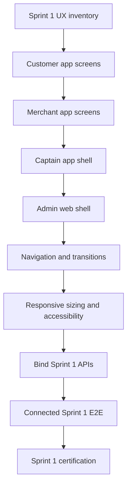
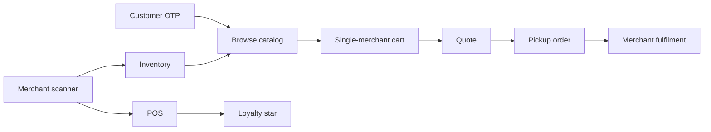

# MyPetNew Sprint Execution Plan

Status: **Frontend-first / Sprint 1 only**  
Version: **2.0**  
Date: **2026-08-11**

## 1. Active execution rule

Only **Sprint 1** is active.

All Sprint 2+ implementation planning has been removed from the active execution plan. Future product requirements remain in the PRD and flow documents only as design/reference input and must not be implemented until a new sprint is explicitly created and approved.

The immediate priority is **frontend design and interaction quality first**, while keeping Sprint 1 backend contracts as the canonical data/state authority.

Do not start later-sprint backend, database, payment, fulfilment, delivery, settlement, coupon, recurring-order, or service implementation merely because those requirements exist in the PRD.

## 2. Frontend-first execution order

Backend work is allowed only when required to make a Sprint 1 screen or Sprint 1 end-to-end flow real and correct.

## 3. Frontend design standard

Every Sprint 1 screen must define and verify:

- visual hierarchy and spacing;
- screen width/height behavior and safe areas;
- reusable buttons, cards, fields, sheets, dialogs, chips, badges and empty states;
- loading, error, retry, offline, permission-denied and no-data states;
- forward navigation, back navigation and deep-link behavior;
- keyboard handling and form focus;
- transition behavior without duplicated or contradictory navigation state;
- touch targets and accessibility labels;
- consistent typography and design tokens;
- server-authoritative business state with no client-invented totals or statuses;
- Android physical-device behavior for scanner/push/permission flows.

## 4. Definition of Done

Sprint 1 is done only when the implementation is merged and evidence exists for:

1. complete Sprint 1 Customer UI and navigation;
2. complete Sprint 1 Merchant UI and navigation;
3. Captain and Admin Sprint 1 shell/workflow requirements;
4. shared design-system consistency;
5. backend unit/domain/API tests;
6. PostgreSQL/Supabase migration and production-profile integration tests;
7. role/tenant authorization tests;
8. idempotency, concurrency and recovery tests;
9. connected E2E across affected apps;
10. scanner/push physical-device evidence where applicable;
11. accessibility and error/offline-state verification;
12. updated traceability and Sprint 1 evidence.

A green build alone does not certify Sprint 1.

## 5. Sprint 1 — Frontend-first walking skeleton

### Objective

Deliver a polished, coherent frontend for the Sprint 1 transaction spine and then connect every visible action to canonical Sprint 1 APIs and state.

### Sprint 1 tickets

| Ticket | Scope | Frontend-first acceptance |
|---|---|---|
| S1-01 | Repository/toolchains/CI/security/evidence baseline. | Frontend lint, typecheck, tests and production builds remain hard gates. |
| S1-02 | Kotlin/Spring Boot modular-monolith, Supabase PostgreSQL/Flyway and infrastructure boundaries. | Backend changes only as needed to support real Sprint 1 UI/API behavior. |
| S1-03 | Separate Customer, Merchant and Captain Expo apps plus Next.js Admin shell; shared design tokens and notification shell. | Establish the visual system, navigation primitives, responsive rules and reusable components. |
| S1-04 | Customer OTP/session lifecycle. | Complete request-code, verify-code, resend/error/session persistence/logout UX. |
| S1-05 | Canonical CUSTOMER/MERCHANT/CAPTAIN/ADMIN authorization. | Each role sees only permitted routes/actions; unauthorized states have intentional UX. |
| S1-06 | Merchant organization/outlet onboarding, Admin approval and service PIN codes. | Complete Merchant onboarding/status UI and Admin approval workflow needed by Sprint 1. |
| S1-07 | Merchant-owned listing/barcode rules and medicine view-only behavior. | Listing create/review/duplicate/unknown barcode states are represented correctly. |
| S1-08 | Merchant scanner. | Camera permission, manual fallback, debounce, known/unknown/duplicate, offline queue and recovery UI. |
| S1-09 | Inventory ledger. | Sprint 1 receive/count/adjust/live-availability APIs and invariants. |
| S1-10 | Merchant inventory screens. | Real receive stock, count variance, low/out-of-stock and history flows. |
| S1-11 | Customer guest catalog/product detail/cart. | Polished catalog, product detail, medicine view-only, cart conflict and auth-boundary UX. |
| S1-12 | Server quote. | Customer sees server-derived pricing, ₹10 platform fee, expiry and stale-quote recovery. |
| S1-13 | Checkout/order aggregate. | Checkout UX handles idempotency, stock conflict, stale quote and success without client-invented state. |
| S1-14 | Merchant order fulfilment. | Incoming queue, detail, accept, prepare, ready, reject/cancel conflict and refresh UX. |
| S1-15 | Merchant POS. | Scanning/cart/customer association/payment declaration/completion/receipt UX. |
| S1-16 | Merchant-scoped loyalty. | Customer and Merchant surfaces show only canonical star/reward state; onboarding/POS star behavior is explicit. |
| S1-17 | Notifications. | Safe in-app/push routing to canonical Customer/Merchant Sprint 1 screens with retry-safe backend behavior. |
| S1-18 | Connected certification. | Real Android scanner/push, Supabase/PostgreSQL, authorization, concurrency, accessibility and connected E2E evidence. |

## 6. Sprint 1 screen priority

### Customer app

1. Splash/runtime state
2. Home/catalog
3. Product detail
4. Cart
5. OTP request
6. OTP verification
7. Quote/checkout review
8. Pickup order confirmation
9. Order detail/status
10. Loyalty
11. Notification inbox/deep-link destination

### Merchant app

1. Merchant entry/session state
2. Outlet/onboarding status
3. Home/dashboard
4. Scanner
5. Barcode resolution/listing draft
6. Inventory
7. Stock receive/count
8. Incoming orders
9. Order detail/actions
10. POS
11. Customer association
12. POS result/receipt
13. Notification inbox/deep-link destination

### Captain app

Sprint 1 remains a shell only unless a Sprint 1 contract explicitly needs a screen. Do not implement later delivery functionality.

### Admin web

Implement only the Sprint 1 control needed for provider review/approval and canonical role access. Do not build later Admin operations early.

## 7. Mandatory Sprint 1 scenarios

- approved Merchant creates a listing from barcode scan/manual fallback and receives stock;
- same barcode is allowed for another merchant but duplicate-within-outlet behavior follows the canonical contract;
- Customer guest browses active products and cannot buy view-only medicine;
- Customer verifies OTP and uses a single-merchant cart;
- server quote supplies canonical prices/fees and stale quotes recover cleanly;
- Customer places one pickup/pay-on-fulfilment order;
- Merchant receives and completes the authorized pickup lifecycle;
- POS consumes live stock and does not double-sell the last unit;
- eligible customer association awards exactly one merchant loyalty star;
- role/tenant attacks reveal no foreign data;
- Merchant order and Customer loyalty notifications deep-link into re-authorized canonical screens;
- offline, retry, invalid token and restart behavior does not fabricate business state.

## 8. Exit gate

Every applicable case in [Sprint 1 Hard Test Contract](../qa/SPRINT_1_HARD_TEST_CASES.md) must pass.

Physical scanner and native-push cases require a development build on a real Android device. Expo Go/emulator-only evidence does not certify those cases.

## 9. Deferred scope

Anything outside Sprint 1 is **deferred**. There are no active Sprint 2 or Sprint 3 tickets, and no later sprint may be inferred from older planning text.

When frontend design and Sprint 1 are complete, future execution planning must be created again from the current PRD and approved as a new baseline.
